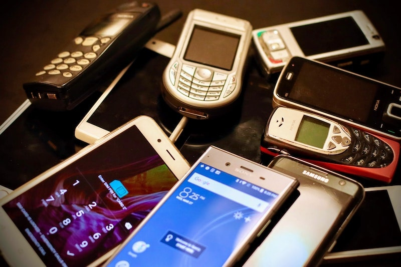
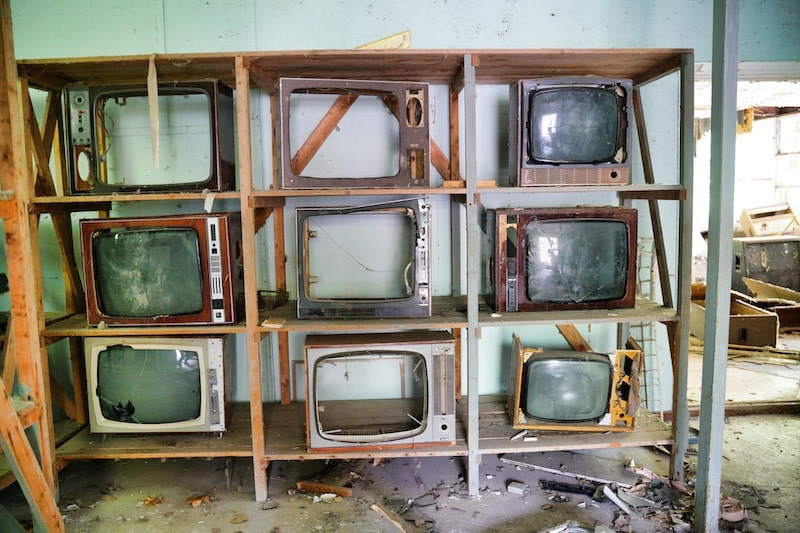
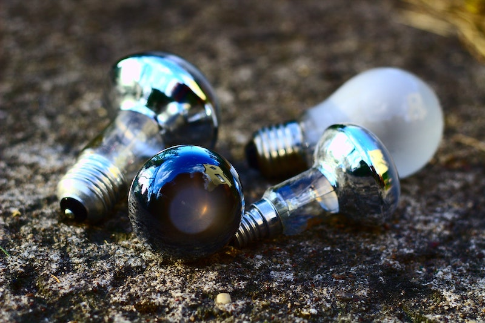
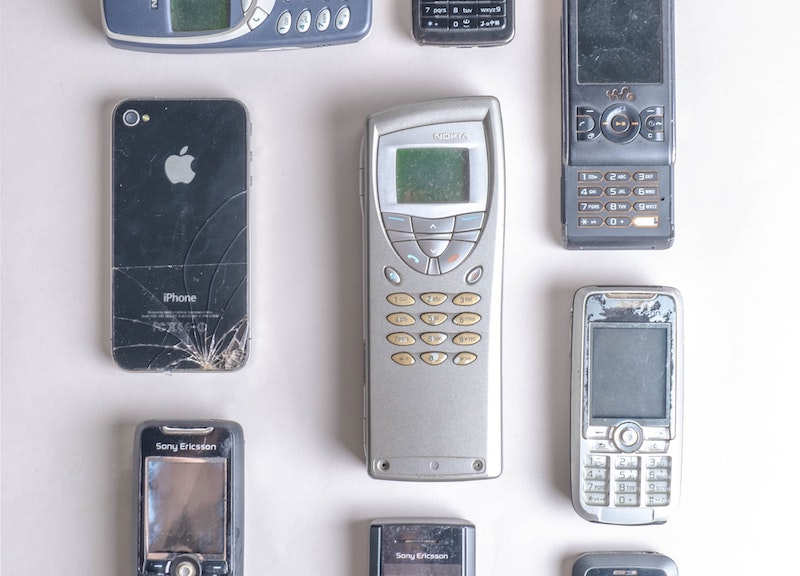

import React from 'react';
import { Link } from 'gatsby';

import Paths from '../constants/Paths.js';

# E-waste Statistics

## Electronic Waste Statistics Overview

E-waste or electronic waste is the result of discarded Electrical and Electronic Equipment (EEE). EEE products include circuit or electronic components and are charged by power cords or battery. Examples of electronic products include everything from mobile phones and laptops to kitchen appliances and smart security systems. 

While electrical and electronic equipment is increasingly essential for modern society to function and are strongly linked with higher living standards, its manufacturing requires the use of natural resources like copper, aluminum, and iron. The improper disposal of electronics results in economic and environmental damage when valuable or hazardous materials enter the waste stream. The following statistics highlight the extent of e-waste generation and the impact of improper disposal of electronic waste in North America and globally.

## Updated E Waste Stats

We sourced the most relevant and updated e waste statistics for you so that you can get a better understanding of electronic waste all in one place.

## Top E-waste Statistics

- Global e-waste amounted to 53.6 Mt (megatonne) in the year 2019. That’s approximately 7.3 kg (kilogram) of e-waste generated per capita!
- E-waste generated across the globe in the year 2019 is equivalent to approximately $57 billion US dollars worth of materials, mostly iron, copper, and gold.
- In 2019, Asia had the greatest quantity of e-waste generated with 24.9 Mt.
- Europe had the highest e-waste generation per capita at 16.2 kg (kilograms) of e-waste per person. 
- On average, global electronics consumption in weight increases by 2.5 million metric tons per year. 
- Global e-waste is expected to reach 74.7 Mt by 2030.
- With current projections, global e-waste is expected to nearly double in weight over a 16 year time period between 2014 and 2030. 
- Global quantities of e-waste generated in 2019 are dominated by electronic or electronic equipment waste in the following categories: small equipment (17.4 Mt), large equipment (13.1 Mt), and temperature exchange equipment (10.8 Mt). 
- 78 countries have adopted a national E waste policy in 2019. 
- In 2019, 17.4% or 9.3 Mt of global e-waste was documented as properly recycled.
- Raw materials from global recycled e waste were valued at $10 billion US dollars in 2019. 
- An estimated 82.6% of e-waste disposal was undocumented in 2019.
- Around 8% of e-waste generated in high income countries is thrown out in waste bins, where it ends up in landfills or is incinerated. This is mostly the fate of smaller equipment or small IT products.
- Small equipment made up the largest portion of e-waste in weight in 2019, but temperature exchange equipment had the largest rate of growth with a 7% increase since 2014.
- It is estimated that 7 - 20% of global e waste generated is exported illegally under the guise of being for reuse or scrap metal.

## E-Waste Recycling and Policy

- Counties with e-waste policies increased from just 61 counties with an electronic waste policy in 2014 to 78 in 2019. 
- 71% of the global population was governed by a national e-waste policy, legislation, or regulation in 2019.
- The official documented amount of global e-waste recycling in 2019 was just 17.4% of total e-waste generated, or 9.3 Mt. E-waste recycling has an annual growth rate of 0.4 Mt, and has grown with 1.8 Mt in 2014. With global e-waste generation increasing by 9.2 Mt at an annual growth rate of 2 Mt, e-waste recycling is not keeping pace with electronics production levels. 
- In 2019, Europe led with the highest e-waste collection and recycling rate with 42.5%, followed by Asia 11.7%, the Americas 9.4%, Oceania 8.8% and Africa 0.9%.
- Recycled e-waste components made of copper, iron, and aluminum contributed to a net saving of 15 Mt of Carbon Dioxide emissions in 2019, which is equal to emissions from the recycling of secondary materials in place of virgin materials.  

## Environmental Impact of E-Waste 

- Unaccounted for e-waste and improper disposal in 2019 is expected to have the following environmental impacts: 98 Mt of Carbon Dioxide equivalents potentially released,  0.05 kt (Kiloton) mercury and 71 kt Brominated Flame Retardants (BFR) in the waste stream.
- E-waste contains the following toxic and potentially environmentally damaging substances: mercury, brominated flame retardants (BFR), and chlorofluorocarbons (CFCs), and hydrochlorofluorocarbons (HCFCs).

## E-Waste Statistics in North America

- North America generated 7.7 Mt of e-waste in 2019. The United States was responsible for 6.918 Mt and Canada 0.757 Mt. 
- North Americans generated an average of 20.9 kg of e-waste per capita.
- 15% of e-waste was properly documented as collected and recycled in 2019.

## E-Waste Statistics Around the World

- Global production of e waste grew by 9.2 Mt since 2014. This number is expected to steadily increase in the coming years, with projections of global e-waste expected to reach 74.7 Mt by 2030.
- In 2019, Asia generated the greatest quantity of e-waste with 24.9 Mt, followed by the Americas 13.1 Mt, Europe 12 Mt, Africa 2.9 Mt, and Oceania 0.7 Mt.
- In terms of e-waste generation per capita, Europe led with 16.2 kg per capita, followed by Oceania 16.1 kg per capita, Americas 13.3 kg per capita, Asia 5.6 kg per capita and Africa 2.5 kg per capita.

## Facts About E-Waste

- The rise in e-waste production is due to three factors: higher consumption rates of electronics or electronic equipment, shorter life-cycles of electronic products, and few repair options for broken or outdated electronics. 
- Three factors increase a society’s consumption of electronic products: higher levels of disposable income, urbanization, and industrialization.
- Recycling of e-waste is not keeping up with global growth in production of e-waste.
- E-waste is sometimes considered an “urban mine,” meaning that it contains precious, critical, and noncritical materials that can be reused as secondary materials. Precious materials discarded in e-waste include iron, copper, and gold components. 
- A small number of studies suggest the following health effects on children as a result of informal, unregulated e-waste recycling: increased or decreased growth, negative effects on immune system and lung function, adverse birth outcomes and altered neurological development. 

## The Six Categories of Electronics and E-Waste

The 54 categories of electronics and electronic equipment are classified into 6 general groupings based on waste management practices and common characteristics. E-waste is discarded materials belonging to the following six categories of electrical or electronic equipments:

### 1. Temperature exchange equipment

This category includes cooling or freezing electronic equipment such as refrigerators, air conditioners, and heat pumps. E-waste in this category was 10.8 Mt in 2019, with a 7% growth from 2014. 

### 2. Monitors and screens

Including TV screens, laptops, monitors, tablets, and notebook computers. E-waste in this category was 16.7 Mt in 2019, with a -1% growth from 2014. 

### 3. Lamps

The lamps category includes LED lights, fluorescent bulbs, and high-intensity discharge lamps. E-waste in this category was 0.9 Mt in 2019, with a 4% growth from 2014. 

### 4. Large equipment

Large Equipment includes common household and business electronic equipment such as electronic stovetops, washing machines, clothes dryers, printing and copying machines and photovoltaic panels. E-waste in this category was 13.1 Mt in 2019, with a 5% growth from 2014. 

### 5. Small equipment

Small equipment includes smaller household and business products like microwave or toaster ovens, vacuum machines, ventilation equipment, electronic toys, scales, calculators, power tools and small medical or monitoring devices. E-waste in this category was 17.4 Mt in 2019, with a 4% growth from 2014. 

### 6. Small IT or telecommunication electronic equipment

This category includes cell phones or mobile phones, GPS devices, or any pocket electronic device such as calculators, personal computers, printers, and routers. E-waste in this category was 4.7 Mt in 2019, with a 2% growth from 2014. 

## E waste solutions

On a global level, e-waste collection data can help reduce negative impacts through the following measures:

- Reducing e-waste generation
- Promoting e-waste recycling
- Preventing improper disposal and treatment of e-waste 
- Creating green jobs in the e-waste recycling and refurbishment sectors

On a national level, e-waste data can limit waste generation by:

- Quantifying the extent and magnitude of e-waste challenges
- Setting appropriate e-waste recycling targets
- Prioritizing e-waste regulation and policy targets on the legislative and policy level
- Allocating the necessary financial resources

## Learn More About E-Waste

To learn more about e-waste generation or electronics and electronic equipment consumption across the globe, be sure to visit <a href="https://www.itu.int/en/ITU-D/Environment/Documents/Toolbox/GEM_2020_def.pdf" target="_blank" rel="noopener norefferer">The Global E-waste Monitor 2020, quantities, flows, and the circular economy potential</a>. All statistics highlighted in this article are sourced from this report which contains updated information for the year 2019. For clarification or greater detail, we suggest consulting The Global E-waste Monitor 2020.

## How to Recycle E Waste

Now that you have a better understanding of current e-waste trends, facts, and figures, you might be wondering how you can help reduce the negative impacts of improper electronic waste disposal. While it is always best to reduce electronics consumption whenever possible, the next best option is to seek out repair or reuse alternatives for unwanted electronics. 

<a href="https://earth911.com/business-policy/e-waste-recycling-laymans-guide-electronics-disposal/" target="_blank" rel="noopener norefferer">Earth 911</a> suggests that you consider the following alternatives for getting rid of old electronics before deciding to recycle: 

- Contact local electronics stores to see if they repurchase, accept returns or offer trade ins for unwanted electronics.
- Try to find <a href="https://earth911.com/eco-tech/electronics-hacks-mods/" target="_blank" rel="noopener norefferer">different uses for outdated electronic devices</a>.
- Some businesses will collect and repair old electronic devices and donate them to nonprofits or families in need. <a href="https://interconnection.org/" target="_blank" rel="noopener norefferer">Interconnection</a> is one such organization. 
- Contact your local <a href="https://www.goodwill.org/locator/" target="_blank" rel="noopener norefferer">Goodwill</a> to see if they accept electronic device donations.
- Try to repair a damaged electronic device on your own with help from <a href="https://www.ifixit.com/" target="_blank" rel="noopener norefferer">iFixIt.com</a>.

If you are unable to reuse, repurpose, or donate unwanted electronic devices, you can use this <a href="https://search.earth911.com/" target="_blank" rel="noopener norefferer">recycling location tool</a> to find recycling options for electronics in your area. 

Here are some helpful tips to keep in mind when recycling electronics or electrical equipment:

- If you can, try to reset the electrical equipment to its standard factory settings in order to protect your privacy. This applies to personal computers, cell phones, or other small devices, but it is just as important to reset smart TVs and printers to avoid potential privacy breaches.
- If your electronic or electrical equipment has a cord, wrap the cord around the device or keep it in a secured loop. This will make the item easier to carry to the recycling center and will also prevent a tripping hazard. 
- If the item is on the larger side, you might want to consider investing in a dolly or other sort of waste container. Be careful when transporting the unwanted electronics to avoid damage. Damaged electronics could potentially expose you to hazardous material components like lead or mercury. 
- For electronics that use a lithium ion battery, remove the battery if possible. These batteries should be transported and recycled with other batteries.
- If you are needing to properly dispose of large amounts of electronic appliances or devices, you may find it helpful to <Link to={Paths.rollOffDetails}>rent a dumpster</Link> or schedule a <Link to={Paths.junkRemovalDetails}>junk removal service</Link> to help you transport e-waste materials to proper collection sites. If your business generates a lot of e-waste you will need a <Link to={Paths.commDumpsterDetails}>recurring dumpster service</Link> to meet your needs on a scheduled basis. Alliance Disposal can help you with all of your e-waste recycling needs, <Link to={Paths.contact}>contact us</Link> for any of your electronic waste disposal questions.

<!-- For more information on how to recycle any sort of large or small electronic or electrical equipment, consult with this <a href="https://earth911.com/recycling-center-search-guides/?utm_source=earth911-header" target="_blank" rel="noopener norefferer">recycling guide</a>. -->