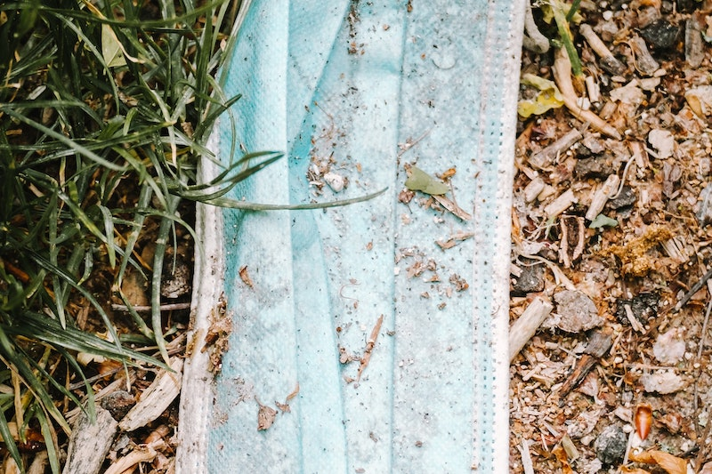
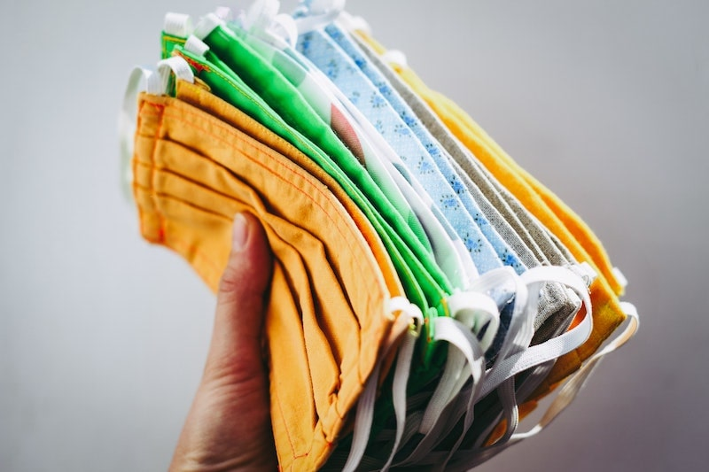
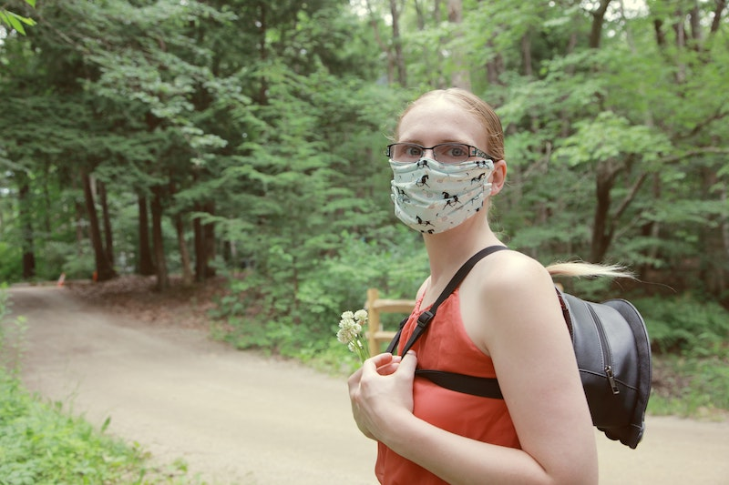

import React from 'react';
import { Link } from 'gatsby';

import Paths from '../constants/Paths.js';

# Environmental Wellness

## What is Environmental Wellness

Environmental wellness can be best described as respecting the surrounding environment and understanding how personal actions impact your health and the health of the environment. Environmental wellness can be fostered by taking simple everyday steps to lead an environmentally friendly and healthy lifestyle while also protecting the earth’s natural resources and inhabitants.

Environmental wellness examples include:
- Living an environmentally conscious lifestyle by reducing, reusing, and recycling whenever possible 
- Taking responsibility for actions that affect your health and the health of others (example: restraining from smoking in public)
- Understanding that your physical environment impacts your wellbeing in both positive and negative ways
- Actively protecting your local environment by working with environmentally friendly organizations or volunteering with community clean up groups
- Restricting the use or production of toxic waste, pollution, or materials harmful to the environment, such as pesticides or plastic litter 
- Advocating for the conservation of natural resources and leaving a legacy of environmental wellbeing for future generations

Now more than ever, it is important to consider your daily personal surroundings and the larger impact your actions have on your health and the health of the environment. Respecting the environment and being environmentally conscious through your everyday choices can lead to habits that will create a positive impact in your community and in your life. In this article, we hope to explain why environmental wellness is always important while also suggesting some simple steps that you can take to improve environmental and personal wellbeing as the world adjusts to the new reality following the COVID-19 pandemic. 

## Why Environmental Wellness Matters 

Why does environmental wellness matter? There are a few key reasons. The first is that practicing environmental wellness protects the earth by reducing pollution and conserving our limited natural resources. Perhaps the most important reason today is that promoting environmental wellness allows us to live safely by limiting creation and contact with natural hazards or man-made pollutants in the environment. 

Respect for your personal health and the health of the earth is critical for long term wellbeing, but the current reality of the COVID-19 pandemic only makes this concern even more urgent. Becoming mindful of how our everyday actions impact ourselves, others, and the earth can help us navigate through these unprecedented times. 

## How COVID-19 is impacting our environment

COVID-19 has brought about new challenges to environmental wellbeing, and shifting waste volumes reflect this. We gathered a few statistics to highlight some key changes that threaten the environment as a result of the pandemic, along with some suggestions on how you can respect the environment while protecting yourself to the best of your abilities during this unprecedented time. 

### COVID-19 and increased residential waste production

While waste loads from large containers outside of businesses, schools, or other commercial properties are expected to decrease due to social distancing and public health guidelines, It is estimated that residential waste production levels will <a href="https://www.lordstown.com/documents/COVID19MunicipalUpdate1.pdf" target="_blank" rel="noopener norefferer">increase by over 30%</a> as more people are being asked to stay home from school and work. When combined with excess waste resulting from panic buying large quantities of supplies and materials, the increase in residential waste production puts additional strain on waste collection services and landfills. 

### How the pandemic is impacting recycling 

Increased residential waste production also impacts recycling in a major way. Before the pandemic, the average <a href="https://mediaroom.wm.com/the-battle-against-recycling-contamination-is-everyones-battle/" target="_blank" rel="noopener norefferer">recycling contamination rate across businesses and communities was about 25%</a>, otherwise 1 in 4 items were improperly placed in curbside recycling bins. With the increase in residential trash, it is also expected that recycling centers will see an uptick in <a href="https://www.lordstown.com/documents/COVID19MunicipalUpdate1.pdf" target="_blank" rel="noopener norefferer">recycling contamination</a>. Recycling contamination occurs when the wrong materials end up in curbside recycling containers, or are mixed with non-recyclable materials like food waste. When this happens, recycling centers see higher processing costs and times along with decreased output material quantity and quality. 

It is also important to keep in mind that recycled materials are often handled by workers when sorted at recycling centers. Tissues, wet wipes, paper towels, masks, latex gloves and other materials used for protection and sanitation should not end up in the recycling bin. Help protect yourself and others while respecting the environment by taking the time to properly recycle waste materials. To learn more, check out our <Link to={Paths.blog + 'simple-recycling/'}>simple recycling guide</Link> or visit the Solid Waste Association of America for more information on <a href="https://swana.org/docs/default-source/resources-documents/c19_guidelines-resident.pdf?sfvrsn=1b45e7a6_2" target="_blank" rel="noopener norefferer">how to help protect waste and recycling workers now</a>. 

### COVID-19 and the increase of single use items 

Before the COVID-19 pandemic, the effort to reduce waste was stronger than ever with various companies and local governments promoting environmental wellness through bring-your-own campaigns for shopping bags, coffee cups, or other reusable items. Due to the pandemic and heightened sanitary concerns, restaurants and major companies like Starbucks, Dunkin’, and McDonalds have have <a href="https://www.wastedive.com/news/byo-coffe-cup-reusables-coronavirus-covid-19-/574817/" target="_blank" rel="noopener norefferer">suspended the use of reusable containers</a>. 

Restaurants are also seeing <a href="https://www.forbes.com/sites/marcochiappetta/2020/03/25/uber-eats-demand-soars-due-to-covid-19-crisis/#29ce64d6580c" target="_blank" rel="noopener norefferer">a greater demand for take out options</a>, leading to an increased use of plastic and styrofoam food containers. Many state governments are also mandating that restaurants temporarily switch to single-use items like disposable menus, and it is estimated that a restaurant serving just 30 customers per day would need to go through about <a href="https://www.musthavemenus.com/feature/single-use-menus.html" target="_blank" rel="noopener norefferer">750 disposable menus per month</a>. Along with this, over 50 single-use reduction policies, mainly concerning the use of plastic bags, have been <a href="https://www.pbs.org/newshour/science/covid-19-has-resurrected-single-use-plastics-are-they-here-to-stay" target="_blank" rel="noopener norefferer">suspended in the United States as of June 2020</a>. 

In addition to changes in single-use waste policies, the pandemic has increased demand for disposable personal protection equipment like plastic gloves, wipes, and masks. These non recyclable items are starting to pile up in the waste stream or are improperly disposed of in public spaces. Not only are personal protective equipment (PPE) items a health hazard when littered on the streets, but they are also an environmental hazard. Improperly disposed of plastic PPE items can make their way into sewer systems or bodies of water, where they ultimately break down into microplastic particles that attract chemicals and other pollutants. These microplastics and their contaminants, along with larger plastic items like gloves that resemble jellyfish, can be mistakenly consumed by marine life and become very <a href="https://www.cnn.com/2020/04/21/us/coronavirus-ppe-masks-gloves-environment-hazard-trnd/index.html" target="_blank" rel="noopener norefferer">detrimental to the marine environment</a>.

With waste-reducing policies being rolled back and more non recyclable materials being produced for personal protection, taking action to improve environmental wellness may be more difficult, but it is also more important than ever. Read on to learn how you can stay healthy during the COVID-19 pandemic, while also respecting the health of others and the wellbeing of the environment. 

## How to Practice Environmental Wellness

You can take simple actions everyday to promote environmental wellness during the COVID-19 pandemic, from opting into wearing a reusable cloth mask when appropriate to remembering to turn off electronics like personal computers when they are not in use while working from home. Here are come suggestions for fostering environmental wellness during the pandemic and beyond.

### Recycle responsibly 

One simple way to practice environmental wellness is by recycling whenever possible. Match your trash can with a recycling bin for an easy reminder. Check your local government’s recycling website to learn more about what materials are acceptable in curbside recycling and other recycling programs in your community. This is especially important when you are buying products that aren’t typically on your shopping list like medication bottles, wet wipes, sanitizers and personal protective equipment such as masks, gloves, and face shields. Continue to follow the CDC guidelines, but remember that not all of these materials should go into curbside recycling, including plastic bottle pumps, latex gloves and wipes or paper towels. Keep in mind that recycling workers come into contact with recycled materials during the sorting process, so be respectful of their health by keeping contaminated materials from reaching your recycling bin. 

If you are spending more time working at home during the COVID-19 pandemic, consider taking small actions like purchasing recycled paper, stationary, and other supplies for your home office. Certain office staples like printer ink cartridges are often recyclable at local office supply stores or may even be refillable. Do a quick google search for local recycling programs before throwing out any old office supplies or electronics.  

When ordering take-out from your favorite restaurant, check locally to learn what food container materials can and cannot be recycled. While plastic wraps, bags and styrofoam containers are typically not recyclable in residential curbside containers, items like cardboard pizza boxes can usually be recycled. Just remember to clean the box of food waste like leftover pizza, pizza crusts, and melted cheese. Look into local recycling or composting programs for other ways to recycle other food waste containers, as some areas provide recycling specifically for items like disposable cups or lids.

### Conserve energy

When spending more time at home, remembering to turn off lights when you leave the room or switching off computers or other electronics when not in use can be an easy way to conserve energy. You may also opt into using energy efficient lightbulbs or adjusting the thermostat for maximum energy efficiency. 

### Reuse whenever possible 

As we mentioned before, the pandemic is having a significant impact on environmental wellness due to the increase in demand for single use items like disposable masks and plastic gloves. While we encourage you to prioritize your personal health and wellbeing by following the <a href="https://www.cdc.gov/coronavirus/2019-ncov/prevent-getting-sick/prevention.html" target="_blank" rel="noopener norefferer">CDC guidelines</a>, you can keep the health of the earth in mind by using washable and reusable cloth face coverings instead of single-use masks when appropriate. Consider purchasing reusable face masks that are made with <Link to={Paths.blog + 'zero-waste-products/'}>zero waste</Link> or recycled materials from <a href="https://www.hfscollective.com/face-mask-cotton-sustainable?sscid=71k4_i7skj" target="_blank" rel = "noopener norefferer">sustainable brands</a>. Visit the CDC website to learn more about how to <a href="https://www.cdc.gov/coronavirus/2019-ncov/prevent-getting-sick/how-to-wash-cloth-face-coverings.html" target="_blank" rel = "noopener norefferer">properly wash a reusable face mask</a> or if you would like to see more <a href="https://www.cdc.gov/coronavirus/2019-ncov/prevent-getting-sick/cloth-face-cover-guidance.html" target="_blank" rel="noopener norefferer">evidence that supports the effectiveness of cloth face coverings</a>. 

### Buy green cleaning supplies

The pandemic has increased demand for cleaning supplies, and rightfully so. Cleaning is essential when it comes to protecting our health by reducing contamination in busy areas or commonly touched surfaces. However, some cleaning products contain harmful ingredients such as <a href="https://www.lung.org/clean-air/at-home/indoor-air-pollutants/volatile-organic-compounds" target="_blank" rel="noopener norefferer">Volatile Organic Compounds (VOCs)</a>. VOCs vaporize into the air, negatively affecting air quality, but they also dissolve in groundwater leading to various short-term and long-term health threats and <a href="https://www.usgs.gov/mission-areas/water-resources/science/volatile-organic-compounds-vocs?qt-science_center_objects=0#qt-science_center_objects" target="_blank" rel="noopener norefferer">environmental concerns</a>.

One way to promote environmental wellness while also protecting yourself from contaminated surfaces is by substituting your cleaning supplies with <a href="https://www.epa.gov/saferchoice" target="_blank" rel="noopener norefferer">safer choices</a>. Today’s green cleaning supplies are just as powerful as traditional cleaners, but they leave out the harmful chemicals and harsh scents. Oftentimes, green cleaning supplies are refillable, which is an additional benefit that promotes environmental wellness in your everyday activities. 

### Sustainable activities to do while staying at home

If you are at home with your kids, there are plenty of fun activities that you can do together that will also teach them about environmental wellness. One idea is to reuse old newspapers, paper waste and other unwanted items to make <a href="https://www.k4craft.com/easy-recycled-craft-ideas-for-kids/" target="_blank" rel="noopener norefferer">arts and crafts</a>. You can also take your kids on a <a href="https://recyclingpartnership.org/wp-content/uploads/2020/04/ReverseScavengerHuntv3.pdf" target="_blank" rel="noopener norefferer">recycling scavenger hunt</a> to learn what materials are and are not recyclable around your home. The Recycling Partnership also has a <a href="https://recyclingpartnership.org/blog-recycling-curriculum-grades-k-3/" target="_blank" rel = "noopener norefferer">free recycling curriculum</a> with activities tailored for grades K-3 and grades 4-5 if you are looking for more ideas. 

### Spend some time outside while maintaining social distancing guidelines

- The CDC suggests that staying physically active is one of the best ways to <a href="https://www.cdc.gov/coronavirus/2019-ncov/daily-life-coping/visitors.html" target="_blank" rel="noopener norefferer">promote mental and physical health</a>. If you are in a less crowded environment, spending some time outside while maintaining social distancing guidelines can be a great way to stay active while getting some fresh air and fostering respect for the beautiful natural environment. The CDC recommends the following outdoor activities if you are able to maintain social distancing guidelines:
- Visiting nearby parks (after checking with local parks and recreation authorities)
- Hiking on spacious trails or sidewalks that allow for 6 feet social distancing 
- Carefully considering the use of playgrounds, and helping children follow social distancing guidelines 
- Visiting open pools while maintaining social distancing 

## How We can Help

Alliance Disposal understands that practicing environmental wellness can be challenging during this unprecedented time. If there is anything we can do to help you navigate your waste disposal needs, we would be happy to help provide you with a <Link to={Paths.services}>reliable and sustainable waste service</Link>. Every time you order a dumpster from Alliance Disposal, we make a donation to <a href="https://onetreeplanted.org" target="_blank" rel="noopener norefferer">One Tree Planted</a> and they plant a tree in a forest in need. 