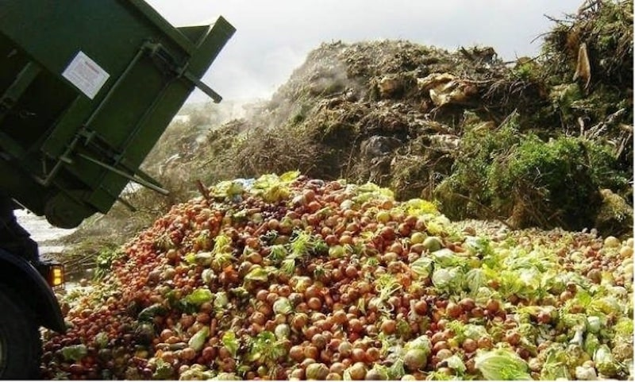

import React from 'react';
import { Link } from 'gatsby';

import Paths from '../constants/Paths.js';

# Food Waste Statistics

Did you know that over 80 billion pounds of food is thrown away each year in the United States alone? 80 billion pounds is equivalent to 1,000 Empire State Buildings. This 80 billion pounds equates to 219 pounds per person. There needs to be change. 22% of municipal solid waste is food, making it the largest component in United States landfills. There are many things Americans and restaurants can be doing to reduce food waste dramatically. Not only is this food waste a threat to the economy, but it is a huge threat to the environment.

## Reasons for Food Waste

### Spoilage

A large factor in food going to waste is spoilage. People are too scared to have an item if it is a day or two after the use by date, and resort to throwing the item out. A lot of people also confuse the “sell by”, “use by”, “best by”, or “best before” date. Customers tend to overestimate the amount of food they need, causing them to buy more and waste it.

### Left in the Fields

Farmers typically reject the food that they know will not sell in supermarkets. Examples of this are fruits and vegetables that taste fine, although they do not look typical. This is usually just a simple discoloring of the food or the shape of the fruit or vegetable is slightly disfigured. Farms leave these foods because customers won’t buy them. In the future, farmers should look into donating these fruits to homeless shelters. If the food is perfectly fine to eat, someone who is not able to afford food would be just fine eating it. There are some great companies out there trying to tackle this problem, such as <a href="https://www.imperfectfoods.com/" target="_blank" rel="noopener norefferer">Imperfect Foods</a>, where they sell these "ugly" fruits and vegetables directly to consumers.

### Food is Thrown Out in the Supermarket

Food is thrown out in the supermarket when it is not sold by the sell by date, or starts to rot. This most commonly happens to fruits and vegetables that are at the bottom of the pile and not taken, so they go bad or overripe. This happens because supermarket's order more than they know they are going to sell, because they don’t want to run out of any items. Supermarkets also believe that customers would rather see <a href="https://www.ecoandbeyond.co/articles/causes-of-food-waste/" target="_blank" rel="noopener norefferer">full shelves of produce</a>. The USDA estimates that supermarkets lose <a href="https://foodprint.org/issues/the-problem-of-food-waste/#easy-footnote-bottom-35-1309" target="_blank" rel="noopener norefferer">$15 billion each year</a> in unsold fruit and vegetables alone.

### Food Waste in Restaurants and Institutions

Restaurants in the United States generate about <a href="https://foodprint.org/issues/the-problem-of-food-waste/#easy-footnote-bottom-35-1309" target="_blank" rel="noopener norefferer">22 to 33 billion pounds of food waste</a> each year. Institutions which include hotels, schools, and hospitals generate an extra 7 to 11 billion pounds per year. This is often due to the fact of people throwing away their uneaten food because restaurant portions have become a lot larger in the past few years. Many restaurants and institutions are scared to donate leftover food because of legal restrictions, they do not want to get sued. Buffets are unable to donate their leftover food because of health restrictions. Although, they typically waste a lot of food because they do not let their food run out before closing. Although it may be hard for buffets, other restaurants and institutions need to begin to be looking into how they can be donating their leftover food.

### Household Food Waste

Households generate the most food waste of any other place. According to foodprint.org, <a href="https://foodprint.org/issues/the-problem-of-food-waste/" target="_blank" rel="noopener norefferer">7 to 11 billion pounds per year</a>. Household food waste typically comes from spoilage or over preparing. When making food for oneself or their family they typically make more than allotted for. Sometimes they throw away the leftovers or take too long to eat them and end up throwing them away.

## Tips on Reducing Food Waste

### At the Grocery Store:

- Stick to your grocery list
- Check each week what you use and don’t use
- Do not buy in bulk
- Buy “ugly” fruits and vegetables, they taste the same!

### At Home:

- Store foods correctly so they do not ripen too fast
- Preserve food, for example: Use an over ripened apple for apple sauce
- Keep fridge clean, therefore you do not lose sight then forget about food
- Saving leftovers
- Keeping track of expiration dates
- Make homemade stock
- Do not overeat, keep track of portions
- Freeze food to eat later
- Compost
- Pack a lunch from home, instead of eating out
- Don’t over serve food
- Keep track of food you throw away to avoid buying again
- Donate to food banks if you know you will not have time to eat before it goes bad

Implement these tips into your everyday life, will make a huge difference in reducing the amount of food you waste, without you even realizing it. Not only that, it can also save you a lot of money in the long run.

## Restaurants that Donate their Leftover Food

Although there are strict guidelines, there are some known companies who are taking their part and donating their leftover food. At Alliance Disposal we love to shout out fellow companies who are doing their part to make a difference. The following stores are a few <a href="https://www.insider.com/restaurants-that-donate-food-at-the-end-of-the-day-2018-8#cosme-donates-food-to-shelters-and-soup-kitchens-6" target="_blank" rel="noopener norefferer">brands who reduce food waste</a>:

### Le Bernardin

- Le Bernardin donates more than 40,000 pounds of food annually to City Harvest, which is New York City’s largest food rescue organization
- Items that are leftover get boxed up and go to shelters for ready-made meals to serve that day
- They most commonly send chicken and rice, seafood stews, bolognese and sides such as salads, potatoes, and grilled vegetables.
- Le Bernardin also sends fresh vegetables and a wide selection of bread and rolls each day

### Starbucks

- Starbacks has currently donated over five million meals
- The company plans to give away 50 million free meals by the end of 2020
- Starbucks partners with City Harvest and Feeding America
- They donate 100% of food available at the end of the day from all of their US stores including breakfast sandwiches, paninis, Bistro Boxes and salads all through Starbucks FoodShare

### Pret A Manger

- Pret A Manger is a chain in the United States and United Kingdom that donated over 8,000 meals to people in need in 2017 alone
- Each night after the store closes, the workers pack up unsold sandwiches and salads, which are then picked up by local food rescue organizations and then brought to local shelters, soup kitchens, and food banks

### Panera Bread

- Panera workers at the end of the day pack up any bread, bagels, and pastries that is unsold and donate it to their "Day-End Dough-Nation" program to give to local hunger relief and charitable organizations
- This allows Panera Bread to always give their customers fresh baked items and if they are left over, put them to good use

### Pizza Hut

- Pizza Hut has donated over 100 million pounds of food to those in need
- They donate error pizzas, no-show pizzas and breadsticks, plus surplus pizza and pasta each day through their Harvest Program

### Cosme

- Cosme is a fine-dining Mexican restaurant in New York City
- In just one month, Cosme donates 162 pounds of food, which equals about 135 meals
- Cosme has estimated by donating their food and keeping it out of landfills, they save an estimated 60 pounds of CO2 from entering the atmosphere

### Olive Garden

- Olive Garden has donated more than 38 million pounds of food since they started the Olive Garden Harvest Program back in 2003
- Olive Garden also donates things like flatware, or uniforms even, or artwork when getting new items

### LongHorn Steakhouse

- LongHorn Steakhouse is owned by the same company who owns Olive Garden.
- They regularly donate their proteins and veggies to local nonprofits through the Food Donation Connection

### Chipotle

- Chipotle donates their leftover food and also donates their kitchenware when updating theirs. This is very considerate of chipotle because this means there is less equipment filling up landfills

### Kentucky Fried Chicken

- Kentucky Fried Chicken (KFC) takes all of the food that is not sold within 60-90 minutes out of the kitchen and then prepares it to be donated. They now reportedly have only a 1.7% food waste rate, down from 2.6% in years past

### The Cheesecake Factory

- The Cheesecake Factory donates all of their food that is still consumable which equals around 500,000 pounds of food per year

It is important for other restaurants to be following good deeds like these stated above. It makes a huge difference in people's lives being able to receive this food. Not only is it helpful for people in need but it is also reducing tons of waste. Especially companies that are donating their kitchen equipment are eliminating so much waste from landfills.

## Tips for Restaurants to Reduce Food Waste

There are many different jobs and tips restaurants can begin to implement if they want to
start making changes to their restaurant. The following tips will help you <a href="https://possector.com/management/restaurant-food-waste-reduction" target="_blank" rel="noopener norefferer">learn where you should begin to reduce food waste</a>:

- Restaurants should be creating a waste management team. It is important they have a group of people who focus on this topic. Not only will reducing waste help make your business help the world, but it will be saving your business a lot of money in the long run. This team will help track and analyze all the food that is being wasted in the restaurant. They will see what is being ordered and what is not. This is because if there aren't many people ordering a particular item on the menu, the food will eventually go to waste. If there are many items that are noticeably not being ordered, take them off the menu or replace it with something new. This will minimize the amount of leftover food, which overall has a great effect on the environment.

- Restaurants should also create a team that is responsible for managing the garbage. It would be smart if this team was also responsible for cleaning the dishes because they are the ones who are able to see what food is typically left over. The team should also include someone who deals with ordering and managing the food so they can keep track of what is not being ordered. When sorting the garbage, it should be separated in two different piles. One should consist of the food that is unused and has gone bad and the other should be with the food that was served and was uneaten so is being thrown out. It is good to measure the two separately so you could see where the greater amount of waste is coming from. It is important to know all these statistics because it helps the restaurant view where they can be improving. It is very important employees understand the importance of reducing waste therefore they will look out more which will help the restaurant determine how to cut it down.

- All employees need to be taught where different waste needs to be disposed. There should be different waste outlets in the restaurant including recycling, compost, and landfill. Staff members need to be aware of which can all of the food/items being served belong.

Once a restaurant implements all of these tips and ideas, there will be many positive changes. It may take some training and getting used to, but reducing food waste will overall save a lot of money and also be helping save the world.

## Overall...

There are so many ways supermarkets, people, and restaurants can cut down the amount of food they waste each year. If every person worked on reducing the amount of food they waste just a little bit, a huge difference can be made. Implementing these tips into your everyday life can help cut the 80 billion pounds of waste thrown out each year, in half! Start taking your part in making a difference today.

## How Alliance Disposal Can Help Reduce Your Food Waste

If you or your business want to start making a positive impact in reducing your food waste footprint Alliance Disposal can help. <Link to={Paths.contact}>Contact us</Link> today to see how we can properly manage your food waste to divert it from landfills and into carbon positive food waste recycling facilities.