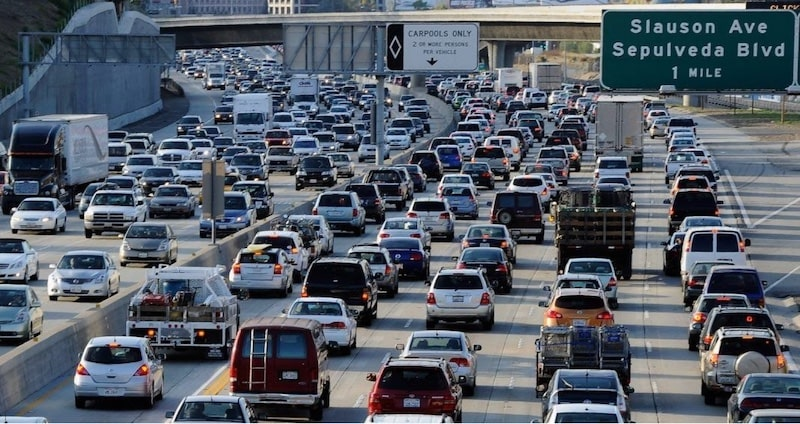
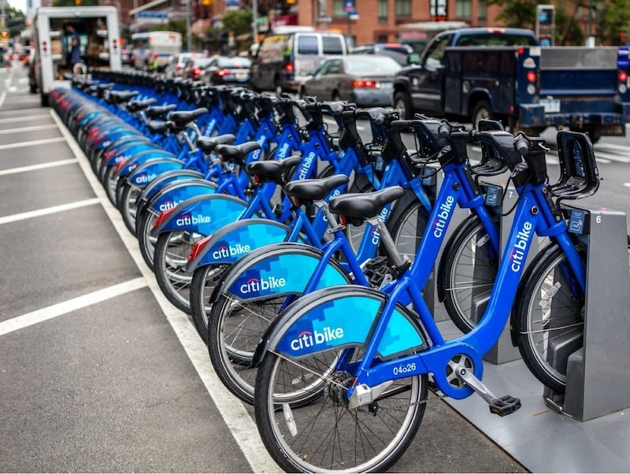
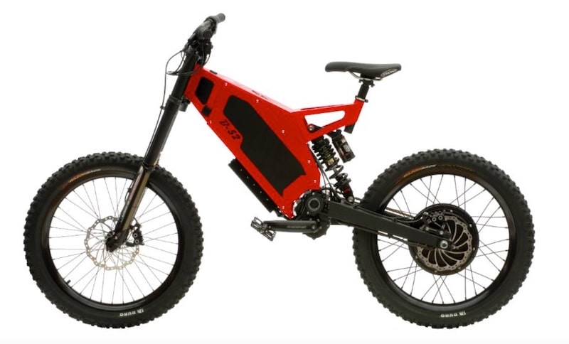
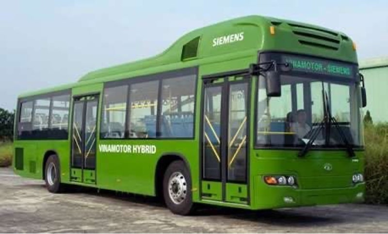
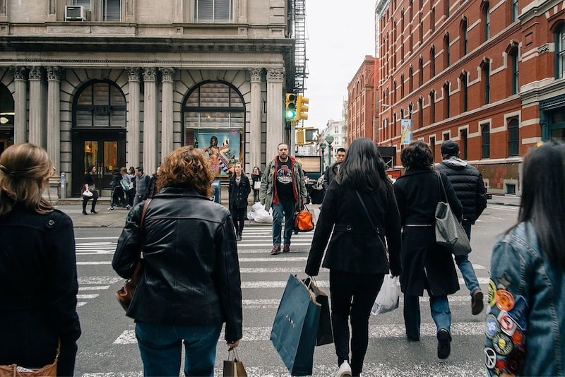

import React from 'react';
import { Link } from 'gatsby';

import Paths from '../constants/Paths.js';

# Green Transportation

Transportation methods are the leading cause of United States Greenhouse Gas Emissions. Cars, trucks, commercial aircraft, and railroads, among other sources, <a href='https://www.epa.gov/greenvehicles/fast-facts-transportation-greenhouse-gas-emissions' target="_blank" rel="noopener norefferer">all contribute to transportation end-use sector emissions</a>. Over the past decade, there have been many improvements made in efforts to reduce greenhouse gas emissions. Transit plays a huge role in environmental sustainability. Mass transit helps improve air quality, reduce greenhouse gas emissions, facilitates compact development, which conserves land and decreases travel demand, and saves energy. The more people that carpool together or take mass transit instead of driving by oneself, will significantly help the earth. In this article you will read about the necessity for green transportation and the different ways how you can take your part in making a difference.

## Transit’s Role in Environmental Sustainability

Air quality is usually the worst in urban and suburban areas where traffic congestion is a problem. This is an issue for residents of these areas because over time they are breathing in this poor air quality. Riding bikes and taking public transportation can help dramatically improve the air quality because if there is a reduction in the amount of cars driving on the road, there will be less pollution in the air which keeps the air quality clean. Rail transit emits <a href='https://www.transit.dot.gov/regulations-and-guidance/environmental-programs/transit-environmental-sustainability/transit-role' target="_blank" rel="noopener norefferer">little to no pollution</a> because it is run on electricity. Although busses do run on gas, most busses use compressed natural gas which produces less pollution. Busses also hold a lot of people, which significantly helps limit the amount of cars on the road.

<a href='https://www.transit.dot.gov/regulations-and-guidance/environmental-programs/transit-environ mental-sustainability/transit-role' target="_blank" rel="noopener norefferer">"Heavy rail transit such as subways and metros produce on average 76% lower greenhouse gas emissions per passenger mile than an average single-occupancy vehicle (SOV). Light rail systems produce 62% less and bus transit produces 33% less"</a>. After reading the statistics on public transportation's role in helping lower greenhouse gasses, it should be deeply considered more. Another plus side to using public transit is that it is a lot cheaper than just driving by yourself. You save a lot of money by not using gas, while saving this world!

## Bike Sharing System

Bike Sharing Systems have been put in many major cities all around the world. They have been put in for residents and tourists to use as an alternative to taking cars or transit. Bike dock stations are placed all throughout the city and can be returned when done at any of the stations. Most companies usually have an app where the user can easily rent the bike. There has been a large spike in bikes in cities which overall has helped reduce emissions by over <a href='https://www.climatefocus.com/sites/default/files/cycling__climate_finance_briefing.pdf' target="_blank" rel="noopener norefferer">eight percent</a>.

One of the most well known bike sharing systems is run by CitiBank. Citi Bike is located in New York City and has been around since 2013. It has become an essential part of New York transportation and caused a huge movement in the industry to spark all around the country. Citi Bike is located throughout all of the New York boroughs and in 2017 the company celebrated their 50 millionth trip. For over a year now, Citi Bike has teamed up with the Lyft app, where you can now rent one of the bikes on the app. This was a smart move allowing the millions of people who already have the lyft app, see the option to rent one of the Citi Bikes as well.

Overtime, bike sharing systems have expanded so much, which has allowed a positive impact on the environment to occur. Shanghai was the first major city to show results from bike sharing systems by <a href='https://www.thebalancesmb.com/how-do-bicycle-sharing-systems-work-4176148' target="_blank" rel="noopener norefferer">cutting down carbon dioxide by 25,240 tons</a>. Since bike sharing systems have just begun to make it big over the past decade, no exact results have been released on the impact it has had on the United States. Although, with there being millions of users all throughout the country, there has sure been a giant impact in helping reduce carbon dioxide in the United States.

## Other Methods of Green Transportation 

### Electric Bike

Electric bicycles were created to help one travel faster. These engines receive the power to go from one peddling the bike. They are much faster than your average bicycle and they do not produce any gases that contribute to pollution. This is a great alternative to use for your everyday life.

### Electric Motorcycles

These motorcycles are completely run on battery and have a charger. They are similar to electric cars. They do not emit any gasses in the air which is a huge advantage versus regular motorcycles. Electric motorcycles are more expensive than gas motorcycles. However, you do not need to constantly keep paying for gas with the electric motorcycle. These are a great alternative and have been reviewed as more comfortable, convenient, and have more power compared to gas motorcycles. They are a great alternative and in the end it is a great way to help save the environment.

### Electric Cars

Electric cars have become increasingly popular over the past decade and are helping change the world. These cars produce little or no local air pollution, reduce dependence on petroleum and have the potential to reduce greenhouse gas emissions. No car has ever done this before. The biggest disadvantage is that these cars are typically more expensive. Although it is hopeful in the coming years that more models will be made in affordable price ranges.

The most well known brand for producing electric cars is Tesla. Tesla is a very popular upscale brand. Although other well known brands also have options of electric cars to choose from such as Mercedes Benz, Mitsubishi, Ford, Chevrolet, BMW, and Nissan. All electric cars get their battery from charging stations, which are now frequently found with the upcoming amount of people that have electric cars. Hopefully in the future more people will begin to realize the importance and need to reduce pollution and greenhouse emissions and look into buying an electric car.

### Hybrid Cars

While hybrid cars do run on gas, they are a lot more fuel efficient than gas cars. Not only does this save the driver money, but it is also using less gas per mile which is better for the environment than a regular gas car. These cars are also less expensive than electric cars, so if you are still looking to help the environment but do not have enough money for an electric car, this is a great alternative. Popular companies that produce hybrid cars include Toyota, Chevrolet, Honda, Ford, Hyundai, Kia, Niassan, Lexus, BMW, Tesla, Chrysler, and Mitsubishi. All of these are very well known car companies and buyers have a variety of companies to choose from when buying their hybrid car.

### Hybrid Busses

Hybrid buses are estimated to cut greenhouse gas emissions <a href='https://www.eesi.org/files/eesi_hybrid_bus_032007.pdf' target="_blank" rel="noopener norefferer"> by as much as 75 percent when compared to conventional diesel buses</a>. Hybrid busses use a diesel engine and an electric motor. The hybrid system enables energy to be recovered while braking and then releases to accelerate the vehicle. Even though hybrid buses cost way above diesel powered buses, hybrid buses emit less pollution into the environment and a much better fuel economy.

### Green Trains

Green trains are currently in use in Europe. These trains can go up to 200 miles per hour which ultimately saves time and cuts back on energy consumption. These trains take cross country trips very quickly. It is working amazingly in Europe and the United States should be looking more into it. They can potentially have trains going from coast to coast in short amounts of time, which will also eliminate a lot of driving trips. 

### Walking

Even though this may be obvious, walking is a great, free alternative for getting from place to place. Especially in cities, walking can sometimes get you to your destination faster, instead of having to wait in city traffic. Walking is the best way to protect the environment and can also keep your body in shape and healthy! The best part of all about walking, is that it is free! If living in a city, one should always check the walking route to see if it can save you time, and money.

## The Importance of Carpooling

### Facts

- On average, households use <a href='https://www.rideshare.com/easy-commute/environmental-benefits/' target="_blank" rel="noopener norefferer"> 1,143 gallons of gas per year</a>.
- In the next 30 years, the amount of cars and trucks on highways is expected to double.
- On average, Americans spend 434 hours in their car every year.
- Every year a car emits its own weight in carbon dioxide pollutants into the air.
- Driving 20,800 miles will emit 23,600 pounds of carbon dioxide into the air.
- Cutting down only 25 miles a week of driving will save 1,500 lbs of carbon dioxide from entering the air. - The United States would be able to save 33 million gallons of gas each day if the average commuting vehicle carried only one extra person.

### Work Carpooling

There are so many opportunities to cut back on miles driven and help save the environment. Suburbs of major cities have thousands of people commuting to the same city five days a week. These people, even neighbors began to drive together, this would be cutting your commuting bill in half. Most commuters from New Jersey driving to New York for work have to pay the toll of the George Washington bridge 5 days a week. This bridge costs up to $16 each way, twice a day. This can save someone over $4,000 if only commuting with one extra person. Filling up a car would make this even cheaper. Commonly people's work places are in different parts of the city, although this is why the New York subway comes in handy. Commuting to the city in a carpool will not only save you thousands of dollars, but it will also reduce traffic time and will cut down largely on the amount of carbon dioxide pollutants entering the air. 

### School Carpooling

Driving kids to school can be very stressful for parents. Having to make it align with their busy schedule and making sure they are still on time for work, it is not easy. School drop off and pickup lines are typically very long. With kids carpooling, not only will this cut down the line and make it go faster, but it will reduce the amount of cars that are there that are putting pollution into the air. Especially with the coronavirus, families may be more hesitant to send their child on a bus. Although, not all parents are able to drive their kids to school every day. There are plenty of options that could be arranged with carpooling with neighbors kids that go to the same school or even searching online for a carpool group. This is great for busy parents, reducing the cost of gas spent, and cutting down on the carbon dioxide being released into the air. 

Whether it be parents carpooling to work together or kids carpooling to school together, every carpool will make a difference in making this earth more environmentally friendly.

## Alliance Disposal Efforts

At Alliance Disposal we do our best to make the transportation of our dumpsters and waste removal as green as possible. For every <Link to={Paths.rollOffDetails}>dumpster rental</Link> we have a tree planted to offset the remaining carbon footprint from servicing it.