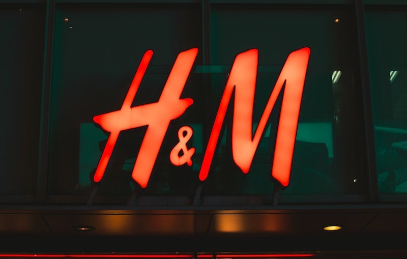
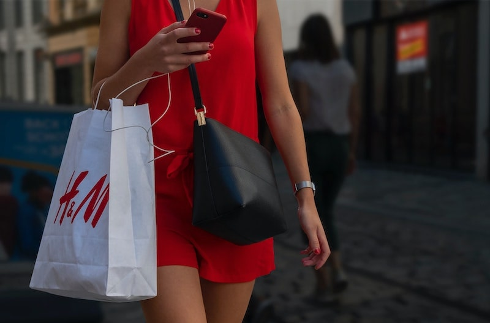

import React from 'react';
import { Link } from 'gatsby';

import Paths from '../constants/Paths.js';

# H&M: An Affordable Ethical Clothing Brand

Alliance Disposal's mission is to <Link to={Paths.about}>achieve carbon neutrality</Link> through our better waste management services and by planting trees. We like to support other companies that have similar values and goals as ours when it comes to sustainability, whether in the waste management industry or any other industry. It is our job as inhabitants of this planet to do whatever we can to keep our home safe, clean, and green.  

## Why Pay Attention

Many people like to shop, so why not save the environment while you shop? There are tons of ethical clothing brands out there that have the environment in mind while producing their pieces and undergoing the overall business process. Though when you really think about it, a lot of those brands are pricey, and sometimes for good reason. If you're a college student who has expenses to deal with but you're also someone who likes to pay attention to what your clothes are made of, obviously you need to look for companies that are more affordable. H&M is the answer to the dilemma. You may be surprised to know that a store commonly seen in many shopping malls is both affordable and ethical because that tends to be a rare case, but it is very much real. In fact, well known magazines have also praised H&M for its sustainability, specifically for its Conscious collection, with pieces made out of organic cotton and recycled polyester. <a href='https://www.forbes.com/sites/blakemorgan/2020/02/24/11-fashion-companies-leading-the-way-in-sustainability/#250bd19e6dba' target="_blank" rel="noopener norefferer">Forbes Magazine</a> believes H&M is one of the many leading fashion brands who is guiding both consumers and the rest of the fashion world towards sustainability and as a result a better environment. <a href='https://www.marieclaire.com/fashion/g22590785/best-sustainable-fashion-brands/?slide=33' target="_blank" rel="noopener norefferer">Marie Claire</a> emphasizes the fact that affordability remains consistent with both H&M's Conscious collection and the rest of H&M's fashion, even though Conscious is more environmentally friendly. 

## How Is H&M An Affordable Ethical Clothing Brand?

H&M Group is a parent company that owns quite a few notable brands like H&M, Weekday, and Monki. Just by looking through H&M's products, one can be tempted to add multiple items to their cart because of how affordable the pieces are. However, price is not the only way H&M chooses to distinguish itself. What you find is not only affordable and fashionable clothing, but also ethical clothing. In <a href="https://hmgroup.com/about-us.html" target="_blank" rel="noopener norefferer">H&M Group's mission statement</a>, it is stated that they strive to make "design available to everyone in a sustainable way." One of their goals is to reduce their environmental footprint, as the fashion industry currently accounts for 20% of the world's water pollution. They have been slowly accomplishing this goal by using environmentally friendly fabrics and ethical production methods. Another ethical initiative started at many H&M stores is a clothing drop off, where in exchange for recycling their used clothes, customers receive a discount for their next purchase at the store. As with most change, it takes time, which is why H&M has a goal to switch over to using <i>sustainable materials and practices by the year 2030</i>. In terms of their clothing and their company's overall contribution to sustainability, their main goals are Leading the Change and Climate Positive. 

### Leading the Change

Right now, sustainable fashion is still an uncommon concept in the fashion industry, so H&M has decided to be the one who starts making small changes towards a better environment, hoping others in the fashion industry will soon follow. This is not to say H&M is the only affordable ethical clothing brand out there, but they are one of the many that have almost started a movement. According to <a href="https://sustainabilityreport.hmgroup.com/leading-the-change/#" target="_blank" rel="noopener norefferer">H&M Group's Sustainability Report in 2019</a>, H&M has already come up with a few different ways to promote responsible consumption, which in turn helps benefit our planet.

- Revolutionizing Resale: If you find yourself not fitting into certain pieces as well as you used to but the pieces are still in good condition, why throw them away when they could be reused? H&M has been investing in digital resale platforms such as Sellply to encourage consumers to try out preowned items rather than buying new ones.
- Rental Fashion: There are some occasions in life where you wear an outfit only once, like a wedding dress or a prom dress. Many people are aware of how expensive those pieces can be, and it may not be worth the investment if it will only be worn once. To remedy this, the H&M flagship store in Stockholm, Sweden now offers the option to consumers to rent pieces from their Conscious as opposed to buying them to only wear once and keep forever. 
- Refurbishment: Like many retailers, COS of H&M Group deals with many damaged items from customer returns and previous seasons. What can one do with damaged clothing, you might be wondering? Well, COS has been working with a company called Renewal Workshop to restore the damaged items. Instead of letting the damaged and once trendy items go to waste, they are used to create new and improved, high quality pieces which are then resold in select stores.
- Artificial Intelligence (AI): AI is a powerful tool used to help improve our lives in many ways. H&M has also been utilizing this technology to help them in their transition to ethical fashion as well as help them predict trends in order to match supply with demand. When you know what consumers want, you are able to give them exactly what they demand, and as a result produce less waste caused by overproduction.

### Circular and Climate Positive

When you think about the production process of most clothing businesses, you probably think of toxic and harmful waste getting emitted into the environment. In their <a href="https://sustainabilityreport.hmgroup.com/circular-climate-positive/#" target="_blank" rel="noopener norefferer">Sustainability Performance Report of 2019</a>, it can be clearly seen that H&M is trying to change that by cutting carbon emissions and trying to produce little to no waste. They have made so many changes in their production and in their business process, and they still have many more changes to make.

- Climate: H&M recognizes the climate crisis as a big deal, and to reduce the damage done, they are working towards a goal to become 100% climate positive by 2040. Not only are they working towards the 2030 goal of cutting their emissions in half, but they are also working to save energy, use more renewables, and going circular (renting, reusing, repairing), all while using the help of artificial intelligence.
- Water: Because most of their production suppliers are settled in Bangladesh, H&M is working to treat wastewater in order to eliminate pollution. They are doing this by investing in advanced treatment technology that can treat the wastewater effectively. H&M is also supporting a partnership hosted by the World Bank called 2030 Water Resources Group, which researches ways to sustain and protect groundwater reserves in Bangladesh.
- Materials: Cotton is a natural, renewable, and biodegradable material. However, organic cotton would be a better option because there are no agrochemicals involved. H&M is a founding member of the Organic Cotton Association, which is an organization that is working to help make organic farming possible for cotton growers. In 2018, 6854 farmers were supported by this organization through training, access to seeds, and premium prices. If they keep this up, H&M will reach its goal of 100% sustainably sourced cotton in the next couple of years. 
- Circularity: H&M has launched The Take Care initiative to help consumers and customers taking care of their clothes. This initiative offers repair services in select stores and online markets. The company also offers in store clothing drops in select stores. The items customers bring in are used in one of two ways: reused as second hand or recycled into new textile fibers or materials. In return, customers are given a discount on their next purchase. Also, for each kilogram collected, two Euro cents are donated to a charity. They’ve also invested in a few companies that develop advanced technologies to make the circularity process easier and simpler. One of the companies they’ve invested in, Infinited Fiber Company, is currently working on creating a new cotton like fiber from waste textiles. A fascinating fact about H&M is that their Conscious Exclusive collection that came out in March 2020 actually includes a dress made out of a fabric created by another one of their investments, Re:newcell.

The company also has plans to, by 2030, package their products using only recycled or sustainably sourced materials. They want to minimize waste and reduce the plastic wrapping for their online orders.   

## What Exactly Makes H&M an Affordable Ethical Clothing Brand?

### Innovation

Their support of <a href="https://www2.hm.com/en_us/hm-sustainability/lets-change.html/innovate" target="_blank" rel="noopener norefferer">innovation</a> means they support companies such as Re:newcell, Worn Again, Ambercycle, and Infinited Fiber because of their innovative techniques and efforts to change the world of fashion. Their values align with H&M’s vision of a sustainable future with affordable ethical clothing. 

### Clean Up

The company has partnered with organizations such as WWF and Solidaridad in their joint efforts to <a href="https://www2.hm.com/en_us/hm-sustainability/lets-change.html/clean-up" target="_blank" rel="noopener norefferer">clean</a> the toxic and harmful atmosphere the fashion industry has created. Their goal is to be climate positive by 2040, and they can reach this goal by reducing and eliminating over washing during the dying process, training staff and suppliers on minimizing water use, and teaching farmers to use less chemicals. They are also currently coming up with better and more ethical ways to manufacture, transport, and package their products. 

### Be Conscious

Their Conscious collection stemmed from their ethical mindset. This collection is made from at least 50% sustainably sourced materials, like organic cotton and recycled polyester. They have a goal to have all of their products be mere from recycled or other sustainably sourced materials by 2030. They’re also encouraging all consumers of all fashion brands to be <a href="https://www2.hm.com/en_us/hm-sustainability/lets-change.html/conscious" target="_blank" rel="noopener norefferer">conscious</a> of what they’re buying and to be aware of the materials used in the products they purchase. 

### Take Care

H&M encourages all consumers to learn how to <a href="https://www2.hm.com/en_us/hm-sustainability/lets-change.html/take-care" target="_blank" rel="noopener norefferer">take care</a> of their clothes the proper way. Different clothes have different care instructions because different materials have different requirements. There are some suggestions they offer such as washing at lower temperature and coming up with different ways to style the same piece of clothing rather than not getting much use out of it. In other words, recycling. They also gave a <a href="https://www2.hm.com/en_us/hm-sustainability/take-care.html" target="_blank" rel="noopener norefferer">helpful online guide </a>that provides tips and DIY inspiration for your own clothes like hemming a pair of jeans and washing your whites. Not only is it saving you money on your energy bill, but it’s also saving the environment. 

### Closing the Loop

It’s surprising how so many of us are unaware of how to properly take care of our clothes. That’s why we see our clothes shrink, lose their elasticity, or lose their vibrancy. H&M provides quite a <a href="https://www2.hm.com/en_us/hm-sustainability/lets-change.html/close-the-loop" target="_blank" rel="noopener norefferer">few ethical suggestions</a> on how to take care of your clothes while also taking care of their environment at the same time. If there is a piece of clothing you know is timeless and something you want to keep as long as possible, make sure you’re washing it the right way. If you’re only going to wear an item once, rent it. If you don’t want an item anymore, recycle if. Give it to charity, do a clothing swap with your friends, or even take it to an H&M store that has a clothing drop in exchange for a store discount. Fun fact: H&M collected 29,005 clothes and textiles through their Garment Collecting program.

### Transparency

Another thing that H&M has in common with Alliance Disposal is <a href="https://www2.hm.com/en_us/hm-sustainability/lets-change.html/transparent" target="_blank" rel="noopener norefferer">transparency</a>. Just like we want our customers to know what their money is going; H&M wants their customers to know how their clothes are being made. That’s why their website allows customers to view all the materials an item consists of when they view a specific product.  
