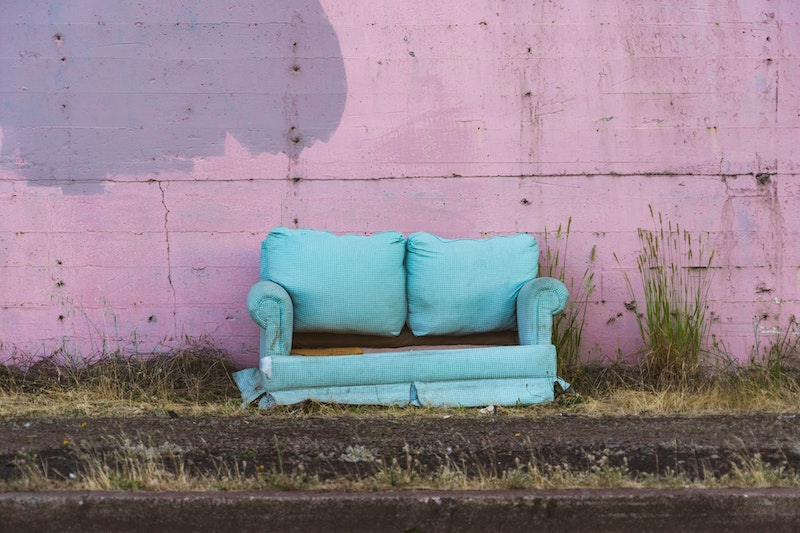
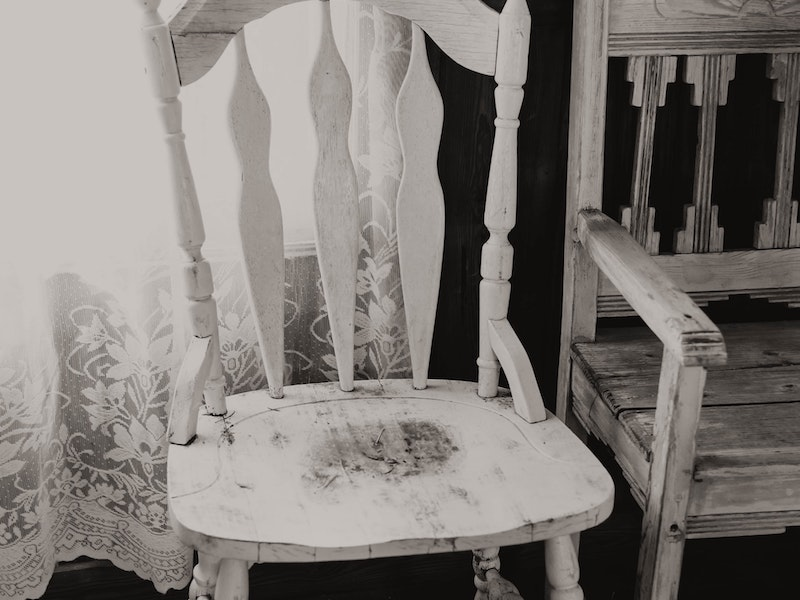
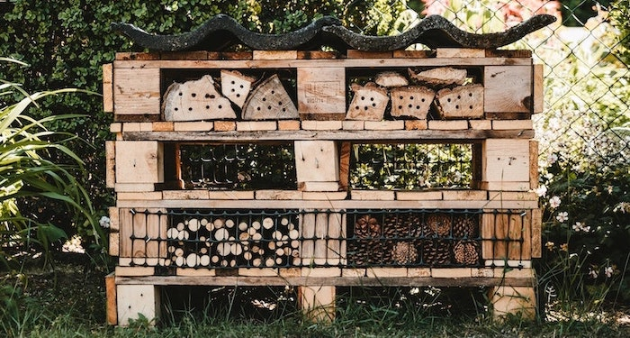

import React from 'react';
import { Link } from 'gatsby';

import Paths from '../constants/Paths.js';
import DumpsterRentalCTA from '../components/service-areas/DumpsterRentalCTA.js';

# Recycled Furniture

## A Solution to Furniture Waste

Every year, billions of pounds of furniture material is discarded in landfills across the United States. According to the <a href="https://www.epa.gov/facts-and-figures-about-materials-waste-and-recycling/durable-goods-product-specific-data#FurnitureandFurnishings" target = "_blank" rel = "noopener norefferer">Environmental Protection Agency (EPA)</a>, furniture waste has increased from 2.15 billion pounds per year in 1960 to nearly 9.80 billion pounds in 2017 with no signs of slowing down. While a significant portion of used furniture is combusted for energy, EPA research suggests about 80% of unwanted furniture still ends up in landfills. That’s a lot of dumped sofas, tables, chairs, and mattresses! 

The good news is that there are many ways to reduce the amount of furniture items that end up in landfills. One of which is by recycling old or unwanted furniture. Whether you are needing to get rid of unused furniture or are looking to purchase new furnishings for your home, recycling furniture is a more sustainable and cost effective option. Read on to learn about the many ways to reduce, reuse, and recycle furniture.

## How to Recycle Furniture

Household furniture is made from a variety of different materials including wood, plastic, metals, fabrics and more. Oftentimes, these materials are combined to make household items like sofas, mattresses, and dressers. Items constructed of multiple materials complicate the furniture disposal process and make it more difficult to recycle in a cost-effective manner. While the best option for furniture is to repair or refurbish whenever possible, it is still feasible to recycle some furniture outright.

### Household Furniture Recycling Guide

Recycling furniture can get a little complicated, but with enough effort, you can find a way to keep your unwanted furniture from landfills. To recycle furniture, follow these simple steps:

#### 1. Check the furniture for personal items
The first step to recycling furniture is removing all of your personal belongings. This means checking between couch cushions for lost items or emptying desk or dresser drawers. 

#### 2. Determine the furniture material
Furniture can sometimes have various material components, but try to determine the base material of your item. For instance, couches and side chairs are often upholstered in leather or cotton. Desks, dressers, table chairs and tables are typically wood or synthetic wood. Outdoor patio furniture tends to be made of plastic or metal. 

#### 3. If Your Furniture is Metal
If your furniture item is made of metal, you should contact your local scrap metal recycler or dealing company. You may be able to have your heavy metal item picked up curbside to lessen the hassle. With metal being in high demand, depending on the material of your item, you may even be able to make some money by recycling your metal furniture. 

#### 4. For All Other Types of Furniture
If your furniture is made of wood, plastic, upholstery or any other type of material, you should contact local second hand stores or bring it to a recycling location. Check out Earth 911’s <a href="https://search.earth911.com/" target="_blank" rel="noopener norefferer">recycling location tool</a> to find options in your area. If you are looking to make some money off of your unwanted furniture, you could also try to sell the item in a garage sale or on a website like <a href="https://www.letgo.com/" target="_blank" rel="noopener norefferer">letgo</a>. For more information on how to recycle or dispose of furniture in an environmentally friendly way, visit this helpful <a href="https://earth911.com/recycling-guide/how-to-recycle-furniture/" target="_blank" rel="noopener norefferer">furniture recycling guide and FAQ</a>.

#### 5. If All Else Fails
You should contact your city government and ask about bulk waste pickup or drop off. Some towns have recycling convenience centers that may take bulky waste. If you are undertaking a home cleanout project and need to dispose of or recycle a number of furniture items, you may need to <Link to={Paths.rollOffDetails}>rent a dumpster</Link> or hire a <Link to={Paths.junkRemovalDetails}>junk removal company</Link> that can do the work for you. 

<DumpsterRentalCTA
    imageAlt='Furniture Dumpster'
/>

## Furniture Donation

Another great way to keep unwanted furniture out of landfills is to give these items away. You can donate various furniture pieces to charitable organizations in need. Habitat for Humanity <a href="https://www.habitat.org/restores" target="_blank" rel="noopener norefferer">ReStores</a> take gently used furniture, appliances, building materials and more. ReStores are locally operated by Habitat for Humanity and sell donated home goods to the public at a fraction of the cost. By making a furniture donation, you support the betterment of your community environment and allow those in need to properly furnish their homes on a budget. For more information about furniture donation pickups and for a list of preferred donation items, visit <a href="https://www.habitat.org/stories/habitat-for-humanity-restores-faq" target="_blank" rel="noopener norefferer">Habitat for Humanity ReStores FAQ</a>. 

The <a href="https://www.salvationarmyusa.org/usn/ways-to-give/" target="_blank" rel="noopener norefferer">Salvation Army</a>, <a href="https://www.goodwill.org/donate/donate-stuff/" target="_blank" rel="noopener norefferer">Goodwill</a>, and the <a href="https://furniturebanks.org/about/" target="_blank" rel="noopener norefferer">National Furniture Bank Association Of America (FBANA)</a> are other charitable organizations that are looking for furniture and home goods donations. Remember that you may be able to receive tax deductions for donating household items in good condition. Ask the organization for a donation receipt and at the end of the year, if you itemize deductions on your taxes, you can claim a tax deduction for your furniture donation. 

## Upcycled Furniture

Yet another way to keep outdated furniture out of your local landfill is simply to repair or update the item. Not only will this save you some cash, but it can be a fun project as well! Repairing furniture can be a great way to level up your skills, and <a href="https://www.familyhandyman.com/woodworking/furniture-repair/" target="_blank" rel="noopener norefferer">online furniture repair guides</a> make it easier than ever to fix up old items on your own. If your furniture is still in good condition, but is looking a little outdated, there are many ways to upgrade or re-purpose furniture. Here are some ideas to get you thinking:

- Reupholster old seat cushions with fresh fabric or give new life to worn sofas with couch covers
- Update wooden furniture like desks, tables, and dining chairs with a fresh stain or coat of paint
- Re-purpose furniture in creative ways, like using old dresser drawers as storage bins or garden planters
- Switch out door handles or cabinet knobs with new hardware for an updated look

For some more tips on how to upcycle your outdated furniture, check out this <a href="https://www.housebeautiful.com/uk/renovate/upcycle/a1911/upcycling-beginners/" target="_blank" rel="noopener norefferer">upcycling guide for beginners</a>. 

## Where to Buy Sustainable Furniture 

If you would rather purchase a piece of upcycled furniture, there are plenty of ways to do so. You can support small business owners by shopping online for <a href="https://www.etsy.com" target="_blank" rel="noopener norefferer">handmade upcycled furniture on Etsy</a> or by visiting local second hand stores or antique shops in your area. 

You can still be sustainable when updating your home interior without having to spend the time or money updating older pieces or purchasing used items. You can get the look of new furniture and still support the environment by buying items made from recycled materials. New technologies make it possible for recycled plastic, wood, and metal to look and perform the same as brand new.

If you are looking to buy outdoor furniture items, consider purchasing from a company like <a href="https://www.polywood.com" target="_blank" rel="noopener norefferer">POLYWOOD Furniture</a> that makes new deck, patio, and garden furniture from recycled plastics that would have otherwise ended up in landfills or the ocean. Your purchases support recycling efforts and you still get a beautiful new piece of furniture that will last years. With advances in recycling technology, material made from recycled plastics can be extremely durable in all climates and seasons.

Another way to decorate your home interior with environmentally-friendly furnishings is by buying new furniture made from reclaimed wood. Many companies have begun using reclaimed wood for furniture not only because it is sustainable, but it is also very beautiful. For example, <a href="https://woodlandcreekfurniture.com/shop-by-style/reclaimed-wood-furniture.html" target="_blank" rel="noopener norefferer">Woodland Creek Furniture</a> uses reclaimed wood from old barn siding to make modern furniture with customization options. Furniture made from reclaimed wood is a great way to support sustainability efforts and it is also highly unique. No two pieces of reclaimed wood furniture are the same, and the history behind the piece will make a special addition to your home. 

Before deciding to purchase a brand new piece of furniture for your home, consider doing a quick google search for new items made from old or recycled materials. This way, you can get the updated look that you were going for while still supporting environmentally friendly companies. Of course, you will also receive the added benefit of adding a piece of furniture with a special backstory to your home. 

## Avoid Fast Furniture

It used to be the case that furniture was built to last and be passed down for generations. In recent years, this type of long-lasting furniture has been overshadowed by what is sometimes called “fast furniture,” or otherwise mass-produced, low quality furniture items. Fast furniture is cheap because it is designed to be disposed of when broken, out of style, or simply when it is too inconvenient to bring along to a new home. 

Most fast furniture is made from short-lived materials such as particle boards covered with veneer or laminate. Not only that, but particle boards sometimes contain toxins like formaldehyde or chemical dyes. The plastic coatings and chemical resins that bind the wood pieces and particles together also eliminate opportunities for the material to be recycled. 

When damaged, the surface can’t be sanded and re-stained like solid wood and the particle boards warp when exposed to damp climates. This is why fast furniture tends to only last a few years at best. While it may seem like a good idea to spend less money when buying this type of furniture, consider the fact that it will only last a few years in your home before it will have to be discarded (likely in a landfill) and you will need to spend more money replacing the item.  

When buying fast furniture, you are also buying a piece that is nothing special. After all, thousands of other people have the exact same item as you in their homes. Instead of buying and re-buying short-lived, mass produced, and low quality fast furniture, it might save you money in the long run when you buy a well-made piece of furniture that will last decades. You can find sturdy furniture pieces at antique stores or second-hand shops, and while you may need to do some DIY furniture updating, in the end you will have a much more sustainable and long-lived home furnishing. 

## The Benefits of Repurposed Furniture 

Whether you are recycling furniture, upcycling old furniture, or buying furniture made from recycled materials, you are making the sustainable choice by reducing the amount of furniture waste in landfills. Repurposed furniture has many benefits beyond just being a sustainable alternative to throwing out used furniture or adding to the problem when buying even more furniture from companies with unsustainable business models. It’s also a cost effective way to update your home interior with special custom pieces. Antique or upcycled furniture is a great way to bring an element of history into any home, and new items made from recycled or reclaimed materials have a unique blend of the modern look and a great backstory. 

When you are undergoing your next home renovation or interior update, consider recycling, donating, or updating your used furniture instead of throwing it out and contributing to the billions of pounds of furniture waste produced and dumped in landfills every year.