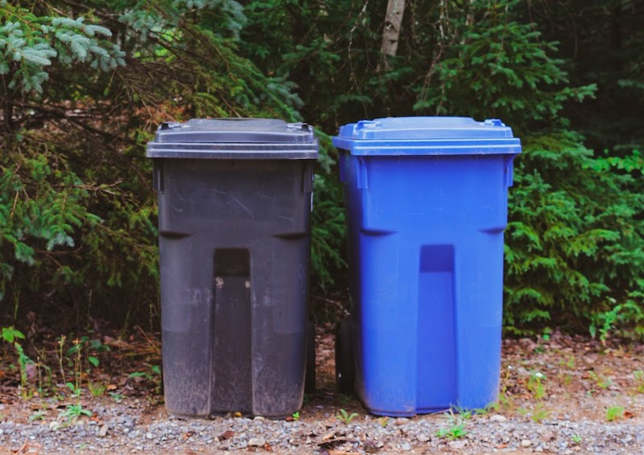
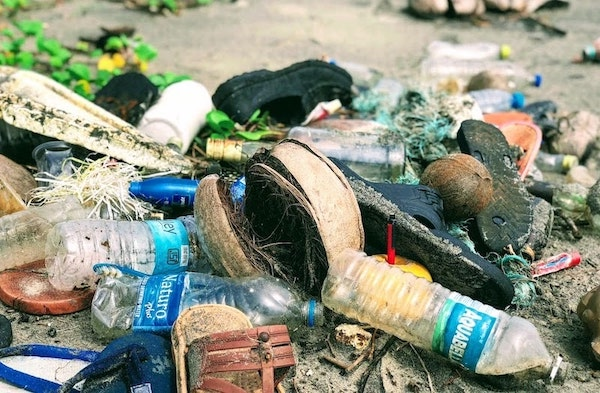

import React from 'react';
import { Link } from 'gatsby';

import Paths from '../constants/Paths.js';

# Recycling Stats Through History

## What is Recycling?

The <a href="https://www.epa.gov/recycle/recycling-basics" target="_blank" rel="noopener norefferer">Environmental Protection Agency</a> defines recycling as “the process of collecting and processing materials that would otherwise be thrown away as trash and turning them into new products." Recycling is one of the most common steps people can take daily to help combat climate change. By removing items that take thousands of years to biodegrade from landfills and re-purposing materials that would otherwise require tonnes of greenhouse gas emissions to produce, we can take the state of our planet one step further in the right direction.

If left unchecked, greenhouse gas emissions from plastic production alone could reach <a href="https://oceanconservancy.org/blog/2019/06/07/recycling-broken-yes/" target="_blank" rel="noopener norefferer">15%</a> of our global carbon budget by 2050. These are greenhouse gas emissions that recycling can, and desperately needs, to reduce. Given that we are dangerously close to reaching climate change’s <a href="https://environment-review.yale.edu/too-little-too-late-carbon-emissions-and-point-no-return" target="_blank" rel="noopener norefferer">"point of no return"</a>, it is becoming increasingly clear that we need to employ every method possible to slow global warming. The amount of waste generated by each American adds up, and it adds up fast. This means there is a huge potential for saving energy and resources through efficient and thorough recycling.

## Recycling Statistics

### Recycling’s Potential

- <a href=":https://utahrecycles.org/get-the-facts/the-facts-plastic/" target="_blank" rel="noopener norefferer">35 billion</a> plastic water bottles are thrown away in America every year that could otherwise be recycled.
- If we recycled all morning newspapers, Americans could save <a href="https://www.lehighcounty.org/Departments/Solid-Waste-Management/Recycling-Facts/Paper" target="_blank" rel="noopener norefferer">41,000</a> trees a day.
- Just <a href="http://lessismore.org/materials/28-why-recycle/" target="_blank" rel="noopener norefferer">one ton</a> of recycled newspapers could save 71 gallons of oil, 7,000 gallons of water, and prevent 60 pounds of air pollutants from being released into the atmosphere.
- If we recycle all plastic waste, greenhouse gas emissions from plastic would be reduced by <a href="https://oceanconservancy.org/blog/2019/06/07/recycling-broken-yes/" target="_blank" rel="noopener norefferer">25%</a> by 2050. It is clear that, if executed well, recycling has the potential to drastically reduce greenhouse gases, deforestation, and landfill usage. However, to what extent are we actually taking advantage of this potential?

### The Progress in Recycling

- The EPA reveals that recycling rates of trash have gradually increased over time. Just over <a href="https://www.epa.gov/facts-and-figures-about-materials-waste-and-recycling/national-overview-facts-and-figures-materials" target="_blank" rel="noopener norefferer">6% of trash was recycled in 1960 compared to over 35% in 2017</a>.
- The amount of waste recycled in 2012 prevented the release of <a href="https://www.thebalancesmb.com/recycling-progress-in-the-u-s-2878054" target="_blank" rel="noopener norefferer">168 million</a> metric tons of carbon dioxide (equivalent to taking 33 million cars off the road) There is no question that we are making slow improvements in recycling, but is it enough? If 35% of trash is being recycled, this means that 65% is not. Despite our progress, there is certainly room for improvement.

### Improvements Are Still Needed

- <a href="https://www.nationalgeographic.com/news/2017/07/plastic-produced-recycling-waste-ocean-trash-debris-environment/#:~:text=You%20can't%20manage%20what%20you%20don't%20measure&text=Of%20the%208.3%20billion%20metric,the%20natural%20environment%20as%20litter." target="_blank" rel="noopener norefferer">91%</a> of plastic waste never gets recycled.
- Every week, <a href="https://www.lehighcounty.org/Departments/Solid-Waste-Management/Recycling-Facts/Paper" target="_blank" rel="noopener norefferer">90%</a> of recyclable newspapers are thrown away (equivalent to 500,000 trees).
- As of 2017, the recycling rate for textiles such as clothing and footwear was only <a href="https://www.epa.gov/facts-and-figures-about-materials-waste-and-recycling/textiles-material-specific-data" target="_blank" rel="noopener norefferer">13.6%</a>.

These statistics display a bleak image of the current state of American recycling, which begs the questions: How did we get here? And why is there still such a long way to go?

## 1800s - 1920s

People have been re-purposing old things into new products for over a millennia. The fundamental concept of recycling is nothing new. We have always been recycling, to some extent. According to <a href="https://www.history.com/news/recycling-history-america" target="_blank" rel="noopener norefferer">History</a>, in the 1800s, when a shirt wore down, you would repair it instead of throwing it away. Recycling began for more economic reasons than environmental ones. Not only were materials like metal difficult to come by, but before waste disposal, stuff would pile up in your home if you didn’t re-purpose it. People would make a living by pedaling down the streets, buying used materials such as metal and cloth, re-purpose them, and then sell them. Household manuals even taught people how to repair glass and use garlic as glue. When garbage disposal started in the late 1800s, many cities separated reusable trash from waste headed to the landfill. Workers sorted through trash on conveyor belts as early as 1905. People understood that products held value, so recycling was always the norm. However, by the 1920s, this separation stopped, and all garbage began to flow directly into landfills.

## 1920s - World War II

The consumer culture of throwing things out after a single use started in the 1900s, when large corporations began profiting off mass consumerism and the idea that “new is better than old." However, consumers and manufacturers alike have always been worried about the lack of infrastructure for dealing with the resulting waste. The first landfill in the United States, Fresh Kills, became a national symbol for waste. The <a href="https://www.smithsonianmag.com/smart-news/how-1970s-created-recycling-we-know-it-180967179/" target="_blank" rel="noopener norefferer">Smithsonian</a> explains that before modern recycling programs, Americans sent nearly 100% of their trash to landfills. In the first half of the 20th century, concerns over single-use products generated PSAs intended to raise awareness of “litter", but consumers were already adapted to use-it-and-throw-it-away products. Given the lack of a clear alternative to dealing with the waste, trash continued to steadily trickle into landfills.

## World War II - 1960s

<a href="https://time.com/4568234/history-origins-recycling/" target="_blank" rel="noopener norefferer">TIME</a> explains that the Great Depression once again caused people to recycle out of economic necessity. Money and resources were scarce, so families would reuse cookie tins as lunch boxes and cloth sacks as fabric. During World War II, Americans were encouraged to collect scrap metal, paper, and cooking waste in order to help the war effort (these initiatives were mostly used as propaganda to get school children involved and help drum up support for the war).

## The 1970s: The Start of Modern Recycling
The <a href="https://www.smithsonianmag.com/smart-news/how-1970s-created-recycling-we-know-it-180967179/" target="_blank" rel="noopener norefferer">Smithsonian</a> continues that the modern system of curbside pickup, recycling plants, and the circular arrow logo are a product of the 1970s. The reason for recycling once again shifted in the 1970s: the need to control waste. The massive amount of waste produced in the second half of the century crowded landfills and demanded a solution. So, states began to try to develop recycling norms. Oregon passed a beverage container deposit law in 1971 and Woodbury, New Jersey became the first city to establish a curbside recycling program similar to the ones we have today. Eventually, the realization grew that there exists an environmental necessity to recycle as well. Thus, the nation created Earth Day and the EPA.

Going into the 21st century, it has become the responsibility of state and local governments to encourage recycling. Towns and municipalities have improved recycling by developing commingled recycling and creative recycling initiatives, and the amount of trash being recycled in the US has slowly increased.

## Recycling Hits a Snag

Surprisingly, much of US recyclables aren’t actually recycled in the United States. For decades, American recycling facilities have compiled plastic bottles, soda cans, and mixed paper, and shipped it all over to <a href="https://www.wsj.com/articles/recycling-rethink-what-to-do-with-trash-now-china-wont-take-it-11576776536" target="_blank" rel="noopener norefferer">China</a>, the world’s largest consumer of scrap products, where it was then recycled and turned into new products. However, in 2018, China banned the import of foreign plastic waste. This was due to health and environmental concerns from the flow of foreign trash and Beijing’s desire to stimulate its domestic trash industry. Unfortunately for US recycling facilities, this meant they were left scrambling for a new market to sell to, especially since other popular markets such as India, Malaysia, and Vietnam have also implemented new restrictions. Developed countries, who were used to shipping their trash off to foreign countries, were forced to reevaluate what recycling was worth to them. Some towns are investing more in their own processing facilities or teaching residents to sort their trash, but other towns have decided to drop recycling programs altogether. <a href="https://e360.yale.edu/features/piling-up-how-chinas-ban-on-importing-waste-has-stalled-global-recycling#:~:text=China's%20%E2%80%9CNational%20Sword%E2%80%9D%20policy%2C,for%20the%20past%20quarter%20century." target="_blank" rel="noopener norefferer">After the world lost its largest market for plastic waste,</a> more plastic is now ending up in landfills or being burned. Already, only 9% of plastic was being recycled, and unfortunately, that number may be getting lower, not higher.

## Covid-19’s Impact on Waste Management Industry

At the end of the day, recycling is an industry, and recycling facilities operate as a business. Unsurprisingly, the Covid-19 pandemic has had inevitable effects on the state of recycling in the US. The Environmental Research & Education Foundation (EREF) and the National Waste & Recycling Association (NWRA) initiated a <a href="https://www.waste360.com/business/weathering-essential-look-inside-covid-19-impact-waste-and-recycling-industry" target="_blank" rel="noopener norefferer">survey</a>, with 400 respondents, to learn how the industry has been affected and its response. Some of the study’s key finding’s include:

- Academic institutions have been the most severely affected, so many laboratory experiments have been pushed back, delaying research results indefinitely
- Over 70% of respondents have seen or expect a decrease in revenue
- Waste haulers have mostly seen a decrease in commercial waste and increase in residential waste
- Despite changes in waste streams, 83% of respondents are not handling waste differently, and of those who are altering how they handle waste, most are leaving recycling untouched
- Among respondents changing how they are handling recycling, nearly 30% are sending all recycling directly to the landfill. Other alterations include: minimal sorting, no manual sorting, no sorting, no collection of recyclables, all waste assumed biomaterials, and office recycling moved to outside areas.

While the industry faced uncertainty at the start of the pandemic, they are starting to see more prominent trends now that things are getting back on track, <a href="https://resource-recycling.com/recycling/2020/08/04/what-to-expect-in-domestic-recycled-paper-markets/" target="_blank" rel="noopener norefferer">Resource Recycling</a> explains that for the OCC (Old Corrugated Containers) industry, the pandemic has actually provided a sliver of good news. Due to the increase in home deliveries, demand is rising for coated recycled cardboard. Although it has not been able to replace the former market in China, this new market is promising enough to incentivize new investments in recycling technology. Companies like NORPAC, Domtar, and Crossroads are confident enough that the increased demand for recycled packaging will continue into the future that they are moving forward with plans to produce more recycled paper and packaging mills. This will create new demand for waste materials that previously went to China and create more opportunities for mixed paper to be recycled.

## What Comes Next?

There are two main prongs of attack needed to improve the future of recycling: infrastructure and societal norms. The US is still lacking in recycling infrastructure, especially when it comes to recycling mixed plastics. Currently, the US is only able to process plastics 1 and 2. We need more infrastructure that is equipped to handle other kinds of plastic. Another solution is to simply stop producing so much throwaway plastic that can’t be recycled. Plastics 3,4,6, and 7 only clog up an already strained recycling system.

The second improvement needed is to simply make recycling more of a norm for both residents and companies. Many people already engage in some recycling, but millions of potentially recyclable products are still being tossed in the trash each day. At Alliance Disposal, we celebrate <Link to={Paths.serviceAreas}>cities and counties</Link> that provide their residents with detailed recycling guides and educational programs. Alliance Disposal also provide <Link to={Paths.rollOffDetails}>roll off dumpsters for recycling</Link> and <Link to={Paths.commDumpsterDetails}>recurring recycling service for your business</Link> as a simple recycling solutions to help. We all need to do our best to support our recycling facilities so that recycling can be as efficient as possible!