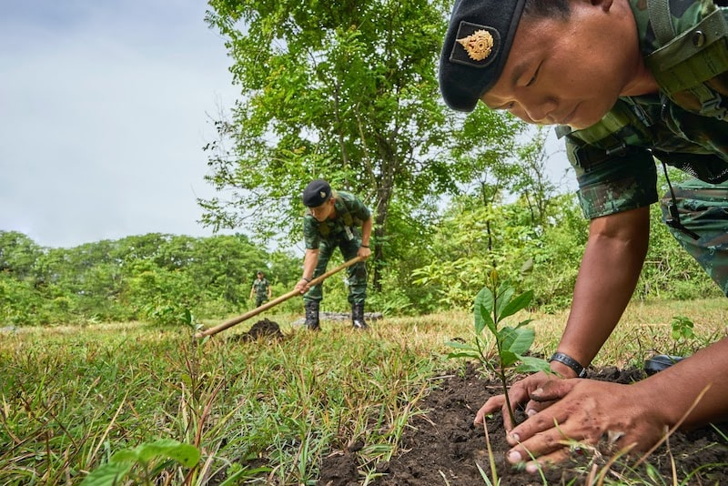

import React from 'react';
import { Link } from 'gatsby';

import Paths from '../constants/Paths.js';

# Using Reforestation to Combat Climate Change

## Reforestation and the Fight Against Climate Change

### Climate Change and Its Effects

Climate change and environmental sustainability are huge concerns for Alliance Disposal and the rest of the world. The Earth has always gone through cycles of glacial advance and retreat, as evidenced by the ice age, but the current warming scenario is unique. This is because, according to <a href="https://climate.nasa.gov/evidence/" target="_blank" rel="noopener norefferer">NASA</a>, there is a greater than 95% probability that it is the result of human activity since the 20th century, and it is proceeding at a rapid and unprecedented rate. Greenhouse gases created by human activities trap heat in the atmosphere. As a result, Earth’s average surface temperature has risen about 1.62 degrees Fahrenheit in the past century alone.

The impacts of this is significant. We have already seen glaciers melting, sea levels rising faster, and more intense heat waves. <a href="https://climate.nasa.gov/effects/" target="_blank" rel="noopener norefferer">NASA</a> also indicates that the US will experience more intense droughts and heatwaves, stronger and more frequent hurricanes, and a sea level rise of 1-8 feet by 2100 if the current trend in global warming continues. The global effects are perhaps even more drastic. Natural disasters caused by climate change are predicted to become the biggest driver of displaced people, 8% of the world population will experience water scarcity by 2100, and agricultural yields will decline significantly, according to <a href="https://www.businessinsider.com/effects-of-climate-change-2014-6" target="_blank" rel="noopener norefferer">Business Insider.</a> Problematically, if global warming hits a 2 degrees Celsius increase in temperatures relative to temperatures before the Industrial Revolution, we will reach what scientists call the "point of no return". As the name suggests, this means the effects of climate change will be irreversible. The <a href="https://environment-review.yale.edu/too-little-too-late-carbon-emissions-and-point-no-return" target="_blank" rel="noopener norefferer">Yale Environmental Review</a> reveals that even assuming a moderate mitigation strategy, we will hit this threshold in year 2035. Clearly, drastic action is needed, and it’s needed now. But what should that action be?

### Reforestation as a Solution

Because plants use carbon dioxide to generate energy and grow, they lead to a net reduction in carbon dioxide over time. They also move moisture into the air which contributes to precipitation. Overall, trees play a crucial role in regulating the Earth’s temperature and weather. However, <a href="https://www.vox.com/2019/7/4/20681331/climate-change-solutions-trees-deforestation-reforestation" target="_blank" rel="noopener norefferer">Vox</a> explains that the world has lost 1.3 million square kilometers of forested area since 1990. This makes reforestation one of the most obvious and straightforward ways to reduce climate change. In fact, according to a research paper published in the journal of <a href="https://science.sciencemag.org/content/365/6448/76" target="_blank" rel="noopener norefferer">Science</a>, there is currently room for an additional 0.9 billion hectares of forests, which could potentially store 205 gigatonnes of carbon. For context, that’s roughly two-thirds of the carbon humans have produced since the dawn of the Industrial Revolution. The researchers conclude that global reforestation is one of the most effective carbon reduction solutions. However, as promising as reforestation is, it is important to remember that it is not a silver bullet. Reforestation is an important component of any climate change mitigation plan, but it must be coupled with additional action such as increasing our use of renewable energy.

## Reforestation -- Planting One Trillion Trees

Since the publishing of the study that revealed reforestation’s potential impact on climate change, several initiatives have popped up to plant one trillion trees around the world. At the start of 2020, the <a href="https://www.weforum.org/agenda/2020/01/one-trillion-trees-world-economic-forum-launches-plan-to-help-nature-and-the-climate/" target="_blank" rel="noopener norefferer">World Economic Forum</a> announced a plan to restore and conserve one trillion trees within the decade. The project, hosted at <a href="https://www.1t.org/" target="_blank" rel="noopener norefferer">1t.org</a>, aims to unite governments, non-governmental organizations, businesses, and individuals in the goal of mass-scale reforestation. This initiative follows existing projects such as the <a href="https://www.trilliontrees.org/" target="_blank" rel="noopener norefferer">Trillion Trees Vision</a>, <a href="https://www.americanforests.org/about-us/mission/" target="_blank" rel="noopener norefferer">American Forests</a>, and the UN’s <a href="https://www.trilliontreecampaign.org/" target="_blank" rel="noopener norefferer">Trillion Trees Campaign</a>. The most recent World Economic Forum project aims to unify these efforts under one platform to mobilize funds and political support toward reforestation. Notable supporters of this campaign include US President Donald Trump and Salesforce CEO Marc Benioff.

## Global Reforestation Efforts

There are a multitude of organizations undergoing reforestation efforts around the world. For example, <a href="https://tree-nation.com/projects" target="_blank" rel="noopener norefferer">Tree-nation</a> has 25 active projects around the world that you can easily donate to, ranging from preserving biodiversity in Tanzania to bringing back the Atlantic Forest in Brazil. They also operate in Kenya, Peru, Argentina, Colombia, Thailand, and more. <a href="https://onetreeplanted.org/" target="_blank" rel="noopener norefferer">One Tree Planted</a> plants one tree for every donation across North America, Latin America, Asia, Australia, and Africa. In 2019 alone, they planted 4,010,962 trees! Even here at Alliance Disposal, we make a donation to One Tree Planted for every dumpster rental! To learn about and easily donate to all the reforestation organizations around the world in one place, download the <a href="https://www.trilliontreecampaign.org/" target="_blank" rel="noopener norefferer">Plant-for-the-Planet</a> app from the Trillion Trees Campaign!

## The Reforestation Debate

As with every idea, there are proponents on both sides of the reforestation debate. Some sources are skeptical that planting one trillion trees is actually the solution to our current climate crisis. It’s always best to recognize both sides of an argument, so below are some common criticisms of reforestation and how those concerns are being addressed and alleviated.

### The numbers are too large

Proceeding the excitement over the prospects of reforestation as a solution to climate change, a group of scientists reevaluated the study. They concluded in their own <a href="https://science.sciencemag.org/content/366/6463/eaay7976" target="_blank" rel="noopener norefferer">study</a> that the estimate that reforestation could cut 205 gigatonnes of carbon is about 5 times too large.

However, while scientists may argue about the exact numbers, one thing is clear. Reforestation is still an effective technique. According to the earlier <a href="https://www.vox.com/2019/7/4/20681331/climate-change-solutions-trees-deforestation-reforestation" target="_blank" rel="noopener norefferer">Vox article</a>, supporting natural systems such as forests is widely accepted as a critical piece of any climate change intervention strategy. 

### Planting trees where they don’t belong

A common critique of reforestation efforts is that we could possibly be planting trees where they don’t belong. Scientist <a href="https://www.theverge.com/2020/1/31/21115862/davos-1-trillion-trees-controversy-world-economic-forum-campaign" target="_blank" rel="noopener norefferer">Joseph Veldman argues</a> that planting trees where they don’t belong could harm ecosystems, worsen wildfires, and even exacerbate global warming.

It is true that trees cannot be planted just anywhere. Unfortunately, planting trees where they don’t naturally belong can actually do <a href="https://theconversation.com/planting-non-native-trees-accelerates-the-release-of-carbon-back-into-the-atmosphere-139841" target="_blank" rel="noopener norefferer">more harm than good</a> because non-native plants can actually accelerate the release of carbon back into the atmosphere. However, this is not a reason to dismiss reforestation as an important tool to mitigate climate change; it is simply a reason to be more careful. When planted in an ecologically safe place, scientists agree that trees are indeed beneficial to reducing carbon in the atmosphere. This means that in order for reforestation to be successful, planters must understand the land and ecology of the region and know what kind of trees can survive and are needed in the particular environment. Thankfully, many of the current reforestation initiatives take this into account, and they connect money to knowledge. A new app called <a href="https://www.terramatch.org/" target="_blank" rel="noopener norefferer">TerraMatch</a> utilizes an algorithm that matches funding offers with projects that are run by experienced planters. This way, people can donate to projects they know are beneficial, and they can be confident that they are helping the planet. Local expertise and international monetary support can connect to ensure safe reforestation initiatives. 

Overall, even critics of the campaign still support trees and their role in the fight against climate change. Their concern is simply over planting trees where they wouldn’t naturally exist, creating "tree plantations" instead of actual forests. To this point, it is important to note that most international efforts, including 1t.org, include initiatives to conserve current forests as well.

### Reforestation isn’t enough

Another common criticism of reforestation efforts is that they lull politicians into a sense of complacency, thinking that no further action needs to be taken on climate change. While reforestation efforts are immensely beneficial, they are not the end-all-be-all to climate change, and they shouldn’t be portrayed as such. There are concerns that painting reforestation as the magic solution causes us to forget about other important sustainability initiatives.

While reforestation isn’t the entire solution, it is still definitely an important part of the solution. However, we do definitely recognize that more must be done. We need policies to deploy clean energy, improve sustainability, and even help indigenous communities protect existing forests. There are many more pieces to the puzzle, but reforestation is a leap we can take in the right direction.

## Alliance Disposal’s Efforts

One of our core goals here at Alliance Disposal is to improve environmental sustainability and do what we can to minimize the carbon footprint left behind by the waste management industry. To do so, we celebrate recycling initiatives of every city and county we service, and you’ll find a detailed recycling guide on each page. Furthermore, we plant a tree for every dumpster rental.

When you use rent a dumpster from Alliance Disposal, you not only get great customer service and pricing, but you also make a positive impact on the world. For every dumpster rented, we make a donation to <a href="https://onetreeplanted.org/" target="_blank" rel="noopener norefferer">One Tree Planted</a>, an organization that specializes in reforestation efforts. Every rental is the equivalent to one tree planted in a reviving forest around the world. Help us heal the planet one tree at a time and <Link to={Paths.orderRollOff}>order your roll-off dumpster rental</Link> today!

With Alliance, you can be sure that you are doing everything you can to help the planet. We are fully committed to the global fight against climate change!

## Additional Reforestation Efforts

We love supporting other organizations who are just as committed to environmental sustainability! Below is a list of more organizations that are undertaking reforestation efforts around the world.

- <a href="https://edenprojects.org/" target="_blank" rel="noopener norefferer">Eden Reforestation Projects</a> -- reduces extreme poverty and restores healthy forests by employing local villagers to plant trees. They have planted over 334 million trees in 8 countries.
- <a href="https://blog.ecosia.org/" target="_blank" rel="noopener norefferer">Ecosia</a> -- a search engine that uses its ad revenue to plant trees around the world. They have planted trees in Colombia, Malawi, Peru, Nicaragua, Indonesia, and more.
- <a href="https://www.reforestaction.com/en/our-reforestation-projects" target="_blank" rel="noopener norefferer">Reforest Action</a> -- aims to restore degraded forests all around the world. They have planted over 7 million trees.
- US Forest Service <a href="https://www.fs.fed.us/forestmanagement/documents/reforestationpartnership/WhatIsUSFSPlantATreeProgram.pdf" target="_blank" rel="noopener norefferer">Plant-A-Tree Program</a> -- honor a loved one with the gift of nature! Your donations will be used to reestablish forest areas in US national parks that have been affected by wildfire, disease, or other events.
- <a href="https://www.nationalforests.org/" target="_blank" rel="noopener norefferer">National Forest Foundation</a> -- plants one tree in a national forest for every dollar you donate.

This is just a short list of the reforestation projects around the world. There are so many fast and easy ways to donate to a reforestation project and do your part in the fight against climate change. It has never been easier to save our planet!