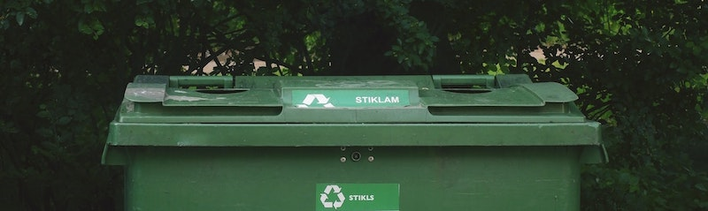
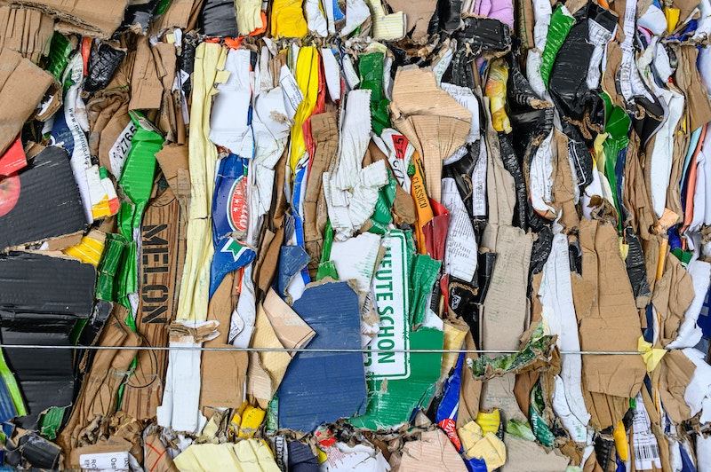
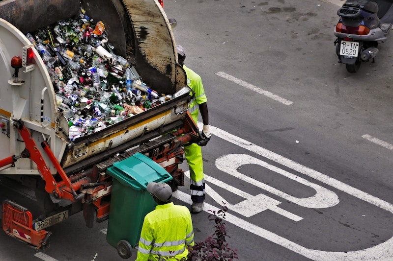
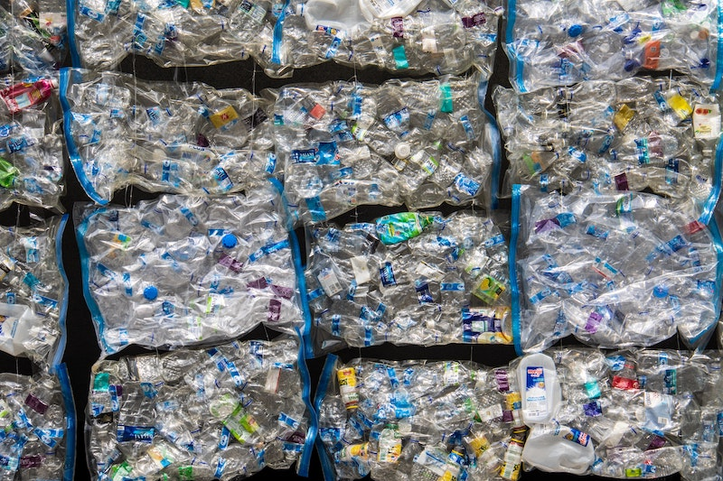

import React from 'react';
import { Link } from 'gatsby';

import DumpsterRentalCTA from '../components/service-areas/DumpsterRentalCTA.js';
import Paths from '../constants/Paths.js';

# Simple Recycling

Waste flows and volumes have changed, and it is time that our industry evolved with it. Alliance Disposal stands for protecting the natural environment by conducting our business in line with simple recycling standards. Whenever possible, we encourage you to join us in our efforts to reduce, reuse and recycle.  

Our goal is to make taking care of the environment as easy as possible. That’s why we want to share a few tips on simple recycling. This guide is meant to help you find answers to questions like "what things can be recycled?" and "why is recycling important?" If you have any more questions on recycling, feel free to contact our <Link to={Paths.contact}>friendly Alliance Disposal team</Link> and we will make sure you get helpful answers.

### What Things Can Be Recycled

Many people wonder what to recycle. While recycling guidelines can vary by state and county, items like clean and dry bottles, cans, cardboard, and paper are generally acceptable for curbside recycling. It’s important that you remember to leave recyclables loose in the recycling bin. Recycling bags are not always accepted. If your area does allow your items to be bagged make sure to use clear see through bags. Common waste materials that should generally not be thrown in recycling bins include:

- Plastic bags, plastic films, or plastic wraps
- Flexible packaging like chip bags or juice pouches
- Food waste items or unclean food containers
- Disposable cups with wax or plastic coatings
- Polystyrene foam or plastic to-go containers, cups, or packing peanuts
- Household items like clothes, fencing, tires, and furniture

While these materials cannot be recycled in curbside collections, we encourage you to reuse items whenever possible to keep waste from the landfill. Some recyclable materials that are not allowed in curbside recycling may be eligible for a local collection program or recycling drop off site. Before you throw away items like old furniture, used tires, outdated electronics, yard waste or other nontraditional items, visit your local county or town website to see if there are any local collection programs for your waste item. You might be surprised to learn that many waste materials can be recycled or reused!

Items that can potentially pose a threat to recycling machinery and employees should never be disposed of in curbside recycling containers. Keep the following materials out of your recycling bins to ensure the safety and continued success of your local recycling center:

- Items that tangle like rope, garden hoses, chains, string lights, or wire
- Scrap metals, propane cylinders or car parts
- Wet waste and dirty diapers
- Medical waste like needles
- Hazardous wastes like fluorescent light bulbs, cleaning products, and other toxic materials

Your county or township likely runs a household hazardous waste disposal program for proper disposal of toxic, corrosive, reactive or flammable materials. Visit the <a href="https://www.epa.gov/hwgenerators/links-hazardous-waste-programs-and-us-state-environmental-agencies" target="_blank" rel="noopener norefferer">EPA’s list hazardous waste programs by state</a> for more information or check out our guide on the <Link to={Paths.guideWhatCanGoIntoDumpster}>hazardous waste items</Link> that should not be thrown in a dumpster or recycling bin.

### Where to Recycle

So now that you understand what types of materials are generally recyclable, you might be wondering where you can properly dispose of recyclables. There are two main options when it comes to simple recycling: recycling drop off or curbside recycling.

#### Recycling Drop off 

The first option is to bring your recyclable waste to a recycling drop off. There are three main types of permanent recycling facilities that you can utilize: bring banks, household waste recycling facilities, and recycling centers. You can find recycling facilities or unique collection programs in your area by searching on your local government website or by using <a href="https://search.earth911.com/?utm_source=earth911-header&utm_medium=top-navigation-menu&utm_campaign=top-nav-recycle-search-button" target="_blank" rel="noopener norefferer">Earth911’s Where to Recycle Tool</a>.

Bring banks are un-staffed collection containers for recycling materials like bottles, glass, and food or drink cans. You can also find collection bins for unwanted clothing items. 

Household waste recycling facilities are staffed recycling drop off sites that typically accept standard recycling materials like cardboard, plastics, paper, cans and glass, but they also may accept hazardous materials like fluorescent tubes, old thermometers, or other toxic chemicals. Some household waste recycling facilities may also accept bulky waste along with yard waste or Christmas Trees during the appropriate seasons. Check with your local <a href="https://www.epa.gov/hwgenerators/links-hazardous-waste-programs-and-us-state-environmental-agencies" target="_blank" rel="noopener norefferer">hazardous waste program or state environmental agency</a> for specific hours and accepted materials.

Your local recycling center is also staffed during certain hours. Recycling centers typically accept a smaller variety of recyclables than household waste recycling convenience centers. While rules may change within your state and county, it is important to know that these centers will typically reject large or bulky items. Contact your <a href="https://www.epa.gov/home/health-and-environmental-agencies-us-states-and-territories" target="_blank" rel="noopener norefferer">local waste authority</a> for more information.

### Curbside Recycling

Curbside recycling can be a very convenient way to participate. What is curbside recycling? Curbside collection of recyclable materials is usually handled through a commercial collection service. While large, bulky items like old furniture or yard waste may not be available for standard recycling curbside collection, you can typically recycle common household items like clean plastic containers, food and beverage cans, paper, flattened cardboard in recycling bins. You should check with your collection service to learn more about what materials are accepted for curbside collection in your county and municipality. 

With Alliance Disposal, curbside recycling has never been easier. Our <Link to={Paths.resiDetails}>residential waste and recycling service</Link> is consistent, dependable, and reliable with scheduled pickups and extra collections. We will get you the appropriate recycling bins for all your recycling management needs, and in most areas you don’t even have to separate your recyclables – just throw them in the recycling can and we will handle the rest! If you are needing to get rid of bulky items, we also offer <Link to={Paths.rollOffDetails}>roll off dumpster rentals</Link> that anyone can take advantage of, even if you already all set with another solid waste collection service. If you have any questions about how Alliance Disposal can help you with recycling management, feel free to <Link to={Paths.contact}>contact us</Link> at any time!

If you are a business in need of a commercial dumpster or recycling container rental, Alliance Disposal has the <Link to={Paths.commDumpsterDetails}>right solid waste container</Link> for your solid recycling needs.

<DumpsterRentalCTA
    imageAlt='Recycling dumpster rental'
/>

## Simple Recycling Disposal FAQs

We know that recycling is important, but that doesn’t mean it is always easy. Recycling can be complicated, especially since the rules and regulations can vary by state, county, or even municipality. Alliance Disposal wants to answer some of your most commonly asked questions on recycling topics, so we put together this list of recycling FAQs. If your question is not answered, please <Link to={Paths.contact}>contact our helpful Alliance Disposal Team</Link> and we will make sure we find you an answer.

### Styrofoam Recycling

Styrofoam, or expanded polystyrene (EPS), is typically not recyclable in curbside recycling bins. However, there are specialized recycling drop off sites that will take styrofoam waste. You can find your local styrofoam recycling location using the <a href="http://www.epspackaging.org/index.php?option=com_content&view=article&id=37&Itemid=38" target="_blank" rel="noopener norefferer">EPS Industry Alliance recycling location tool</a> or by contacting your local waste authority.

### Cardboard Recycling 

Most curbside recycling collections will accept flattened cardboard. Be sure to remove all packaging plastics, tape, or food waste on the cardboard. Can you recycle pizza boxes or other food containers? Yes! Just be sure to cut out oil or food stained pieces of the material. If your county or municipality does not accept cardboard in regular recycling bins or if you are wanting to recycle wax-lined cardboard, you can visit the <a href="https://earth911.com/recycling-guide/how-to-recycle-cardboard/#recycling-locator" target="_blank" rel="noopener norefferer">Earth911 corrugated cardboard recycling location tool</a>.

### Plastic Recycling Numbers

Plastic Recycling numbers range from 1 to 7. These recycling number symbols on plastic waste materials can help you determine if the material is likely to be recyclable in curbside collection recycling bins or not. Here is a quick summary of plastic recycling numbers:

- Plastic number 1 is PETE, PET, or polyethylene Terephthalate. It is usually accepted in curbside recycling. Typical #1 plastics are soda and water bottles.
- Plastic number 2 is HDPE or High Density Polyethylene. #2 plastic is typically opaque and is usually accepted in curbside recycling bins. Plastic 2 is commonly used for milk jugs, shampoo bottles, household cleaner containers, yogurt tubs and more. 
- Plastic number 3 is called V or PVC Vinyl. Plastic #3 can be found in food wraps, detergent bottles, medical equipment, and plumbing pipes. It is rarely accepted in curbside recycle bins. 
- Plastic number 4 is LDPE or Low Density Polypropylene. This material is commonly used for plastic shopping bags, squeezable bottles, frozen food containers and some food wraps. This plastic is not traditionally accepted in curbside recycling.
- Plastic number 5 is PP or Polypropylene. Plastic #5 is becoming increasingly more common in acceptable curbside collection. Medicine bottles, ketchup bottles, and syrup bottles are all considered plastic 5. 
- Plastic number 6 is PS or Polystyrene, commonly known as styrofoam. This type of plastic is not accepted by most recycling programs, and is used in disposable cups and plates, meat trays, and egg cartons. 
- Plastic number 7 is categorized as other or miscellaneous plastics. Number 7 plastic is used for phone cases, sunglasses, nylon, bullet proof material, and plastic gallon water bottles. 

### How to get rid of old furniture

Furniture removal can be a time consuming and difficult process. Unfortunately, most furniture items are not easily recyclable. We recommend that you try to reuse or re-purpose bulky household furniture and appliances through apps like <a href="https://www.letgo.com/" target="_blank" rel="noopener norefferer">letgo</a>. You can also donate mirrors, sinks, cabinets and other fixtures to <a href="https://www.habitat.org/restores" target="_blank" rel="noopener norefferer">the Habitat for Humanity ReStore</a>. If your furniture is not able to be salvaged, Alliance Disposal offers <Link to={Paths.resiDetails}>on-demand pickup services</Link> and <Link to={Paths.rollOffDetails}>dumpster rentals</Link>. 

### Cell Phone Recycling

Cell phones can be recycled along with other old electronics at e-waste or electronic recycling centers. You can also trade in your cell phone when getting an upgrade, or locate a cell phone or battery recycling <a href="https://www.call2recycle.org/locator/" target="_blank" rel="noopener norefferer">drop off location near you</a> via Call2Recycle. 

### All Metal Recycling

You can make money by recycling metal! The general rule for recycling metal is that the product needs to be at least 50% metal. That means if the metal is surrounded by a plastic coating, it is probably still good to recycle. Common nonferrous (not containing iron) metals such as copper, brass, aluminum, nickel, tin, lead, stainless steel, and zinc are all recyclable. Use the <a href="https://earth911.com/recycling-guide/how-to-recycle-metal/#recycling-locator" target="_blank" rel="noopener norefferer">Earth911 scrap metal recycling locator tool</a> to find a metal recycling center near you.

### Yard Debris and Wood Recycling

Many cities have special yard waste curbside collections or composting programs. Check with your local county or municipality to see what services are available. Alliance Disposal can also provide you with a <Link to={Paths.yardDumpsters}>yard waste container</Link> if you are undertaking a large or small landscaping project. 

### Construction Recycling

Construction and demolition materials can be recycled. If you are looking for concrete recycling or asphalt recycling, or would like to recycle any other construction debris, use the <a href="https://earth911.com/recycling-guide/how-to-recycle-construction-waste/#recycling-locator" target="_blank" rel="noopener norefferer">Earth911 locator for a construction recycling center</a> in your area. You can also use an Alliance Disposal <Link to={Paths.constructionDumpsterRentals}>construction dumpster rental</Link> and we will ensure it is brought to the nearest recycling facility, as well as save you a lot of time when cleaning up C&D waste. 

## Recycling Perks

Keep your community clean and support a healthy environment by joining Alliance Disposal in our simple recycling efforts. Reducing, reusing, and recycling has been shown to not only be good for the environment, but also good for saving money, energy, and resources. If you would like to learn more about how recycling can benefit you and your community, visit the United States Environmental Protection Agency’s <a href="https://www.epa.gov/recycle" target="_blank" rel="noopener norefferer">guide on how to reuse, reduce, and recycle</a>.

## Alliance Disposal Supports Simple Recycling

Our mission is to achieve carbon neutrality in the waste management industry through innovation, improved efficiency and planting trees. We prioritize sustainability and modern solutions so that living a greener life is easier than ever for our customers. Learn more about how <Link to={Paths.about}>Alliance Disposal</Link> is disrupting the waste management industry and making a difference for a healthier planet. 

Alliance Disposal ensures that environmental sustainability is at the heart of what we do. That’s why we make it a priority to make recycling as simple and easy as possible for our customers. Our simple, mobile friendly apps allow homeowners, companies, and organizations to conveniently manage all of their recycling and needs. If you would like to set up a <Link to={Paths.resiDetails}>residential waste and recycling service</Link>, or get a quote for <Link to={Paths.commDumpsterDetails}>commercial dumpster and recycling containers</Link>, we would be happy to help meet all your waste needs in an environmentally conscious manner.