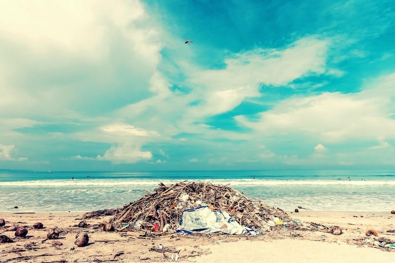
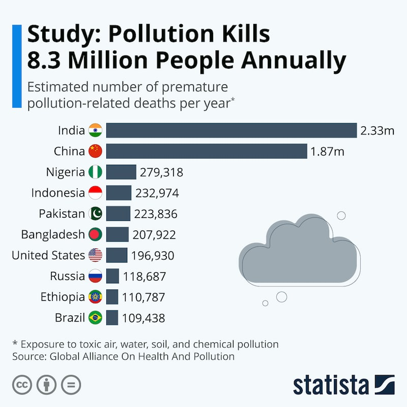
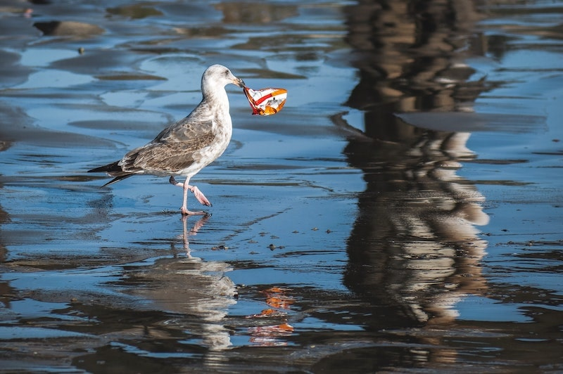

import React from 'react';
import { Link } from 'gatsby';

import Paths from '../constants/Paths.js';

# Water Pollution Statistics

We live in an advanced society where technology and various other inventions are a regular part of our life. Because we get so swept up in our daily lives especially while using these technologies, we sometimes forget to realize where they come from. In the creation of these technologies, harmful gases are created and spread into the air. This then starts the process of pollution, which is the release of (often harmful) contaminants into the environment, whether into the air or into our bodies of water. Air pollution can be both unavoidable and unfortunately sometimes necessary, but what about water pollution?

## Water Pollution Stats Around The World

The image above is a graph provided by <a href='https://www.statista.com/chart/20360/premature-pollution-related-deaths/' target="_blank" rel="noopener norefferer">Statista</a>. It illustrates the effects of pollution all around the world, air, water, and etc. The top three nations with the greatest number of pollution related deaths per year are India, China, and Nigeria, with India being responsible for 2.33 million deaths and Nigeria being responsible for 279,318 deaths per year. This is in 2019 alone, and some forms of pollution keep increasing every year.

“A 2016 preliminary assessment of the water quality situation in rivers in Latin America, Africa and Asia…estimates that severe pathogenic pollution affects around one third of all rivers, severe organic pollution around one seventh of all rivers, and severe and moderate salinity pollution around one-tenth of all rivers in these regions.” This analysis reported by the <a href='https://www.unenvironment.org/explore-topics/water/what-we-do/tackling-global-water-pollution' target="_blank" rel="noopener norefferer">United Nations Environment Programme</a> illustrates what water pollution looks like all over the world. When you look into some of the countries located said mentioned continents, you can kind of get an idea of what they’re talking about. China is one of the biggest producers in the world, so you would expect the country to be troubled with air pollution as well as water pollution, due to the waste created by industrial factories as well as the incorrect and improper disposal of said waste. Though some countries in Africa such as Libya and Ghana not only have contaminated water, but also lack of resources and money to remedy their problem. That is why so many people in these impoverished countries contract various and dangerous ailments, and they often end up dying, especially young children or older adults with weakened immune systems.

## What is Water Pollution?

Water pollution is the contamination of bodies of water such as lakes, rivers, oceans, and etc. This in turn ruins the quality of water and hurts the aquatic life living under water, and it can sometimes also reach our own household water sources and harm our health as well. What causes water pollution mainly has to do with human activities, such as trash throwing, disposing of industrial and production waste improperly, and general incorrect waste management. Common pollutants of water include trash that we throw into the water or throw on the streets and end up in water. Other surprising sources are sewage and industrial waste. In fact, according to <a href='http://www.unesco.org/new/en/natural-sciences/environment/water/wwap/facts-and-figures/all-facts-wwdr3/fact-15-water-pollution/' target="_blank" rel="noopener norefferer">UNESCO</a> (United Nations Educational, Scientific, and Cultural Organization), untreated sewage in many developing countries is often released and pollutes oceans, rivers, and lakes. Not only that, but oil spills such as the Deepwater Horizon oil spill of 2010 also cause a lot of damage to our waters and especially to the aquatic life that resides under water. And while a lot of us around the world do our best to prevent the different forms of pollution, it is going to take a lot more time because water pollution is rapidly continuing to grow around the world. In fact, according to the <a href='https://www.nrdc.org/stories/water-pollution-everything-you-need-know' target="_blank" rel="noopener norefferer">NRDC</a>, almost half of the rivers and one-third of the lakes in the United States are too unsafe to fish from, swim in, or even drink from because of how polluted they are.

<a href='https://www.usatoday.com/story/news/2017/08/14/63-million-americans-exposed-unsafe-drinking-water/564278001/' target="_blank" rel="noopener norefferer">USA Today</a> published an article in 2017 stating that almost one fifth of the United States (which is almost 63 million people) don’t have access to clean water. Said water may include contaminants such as chemicals from various sources and arsenic. And unfortunately, some of the population exposed to this unsafe water reside in areas that cannot afford the resources and the equipment to help filter out these contaminants. As a result, many people are susceptible to cancer, gastrointestinal disease, and development problems for children. Contaminated water has actually been a frequently occurring problem in recent years, as we were able to see happen to communities in Flint, Michigan and in East Chicago, Indiana. In their cases, the water had been contaminated with lead, which was a result of older pipes. Statistically, these problems occur in places where there is more poverty or people who lack resources. 

We at Alliance Disposal encourage not only our customers, but everyone in general to learn more about water pollution and its effects. We care about our environment, and we want to preserve, protect and improve it for years to come. In fact, we have partnered with One Tree Planted to help us accomplish our goal of achieving carbon neutrality in the waste management industry. For every dumpster rented, we make a donation to One Tree Planted, and they plant a tree in a forest in need of more vegetation. If you would like to learn more about our sustainability efforts, read more about <Link to={Paths.about}>Alliance Disposal's sustainability efforts</Link>.

## Water Pollution and Your Health

The CDC (Centers for Disease Control and Prevention) provides valuable and helpful information on the subject of water. It is important to be aware of how unclean, contaminated water can affect not only the environment, but also us and our health. Some connections between contaminated water and human health include:

- There are standards and regulations set by the United States Environmental Protection Agency that all public water systems must follow, by law.
- Community water fluoridation prevents tooth decay, and it is known as one of the biggest environmental accomplishments of the 20th century.
- 780 million people in the whole world do not have access to clean water sources
- Contaminated drinking water, lack of water for hygiene use, and lack of sanitation practices all contribute to 88% of deaths due to diarrheal diseases worldwide.
- In 1993, the largest waterborne disease to ever happen in the United States took place. This disease was caused by a parasite, Cryptosporidium, that had contaminated the drinking water of Milwaukee, Wisconsin. 

<a href='https://pacinst.org/wp-content/uploads/2013/02/water_quality_facts_and_stats3.pdf' target="_blank" rel="noopener norefferer">The Pacific Institute for Studies in Development, Environment, and Security</a> is an American non-profit organization that focuses its research on environmental and development issues with a specialized focus on global and regional freshwater. They also provide useful and important information on the subject of water pollution statistics such as:

- Every day, 2 million tons of sewage, industrial, and agricultural waste is released into water all around the world. This is the equivalent of the weight of 6.8 billion people.
- Infectious waterborne diseases are the number one killer of young children all around the world. More people die from contaminated water every year than from war and other forms of violence.

Because water pollution affects both us as humans and our environment, it is up to us to take steps towards fixing this problem. If we don’t take the steps to fixing water pollution, we could harm ourselves and those who live in impoverished areas because contaminated water can make us ill and sometimes even cause death. 

## How to Help Stop Water Pollution

There are many ways we can stop, or at least reduce and prevent, water pollution. According to <a href='https://www.nrdc.org/stories/water-pollution-everything-you-need-know#:~:text=To%20put%20it%20bluntly%3A%20Water,sickens%20about%201%20billion%20people.' target="_blank" rel="noopener norefferer">NRDC</a> (Natural Resources Defense Council), we can:

- Reduce the amount of plastic use or recycle and reuse plastics correctly.
- Dispose of waste properly using services such as a <Link to={Paths.rollOffDetails}>dumpster rental</Link>, proper <Link to={Paths.resiDetails}>waste services for your home</Link> and <Link to={Paths.commDumpsterDetails}>business waste services</Link>.
- Dispose of chemical cleaners, oils, and non-biodegradable items correctly to make sure they don’t end up in places they don’t belong, like our waters.
- Regularly check up on your car and take it to get serviced regularly so it doesn’t leak oil, antifreeze, or coolant.
- If you have a yard, consider landscaping that reduces runoff and avoid applying pesticides and herbicides. Be sure to properly dispose of any <Link to={Paths.yardDumpsters}>yard waste</Link>.
- If you have a dog or any pet that can go outdoors, make sure you clean up after them, especially after they poop. 