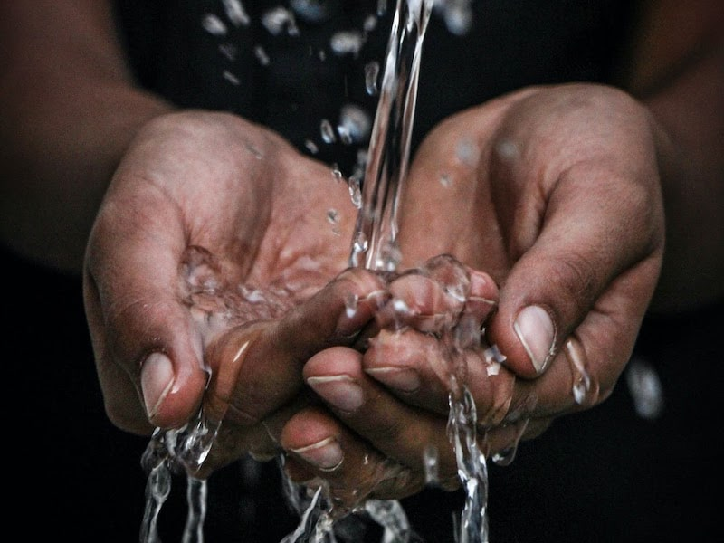
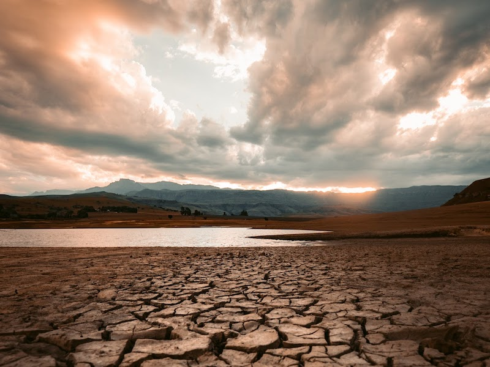

import React from 'react';
import { Link } from 'gatsby';

import Paths from '../constants/Paths.js';

# Climate Change and its Impact on Water Security

## How Climate Change Affects Water Security

Water is important. We all know this. We depend on water to sustain our health, agriculture, energy production, manufacturing, and more. In short, water is imperative to our survival on this planet. Unfortunately, rapid climate change is already creating problems for water security all around the world. The <a href="https://www.unwater.org/publications/water-security-infographic/" target="_blank" rel="noopener norefferer">United Nations</a> defines water security as “The capacity of a population to safeguard sustainable access to adequate  quantities of acceptable quality water for sustaining livelihoods, human  well-being, and socioeconomic development, for ensuring protection against  water-borne pollution and water-related disasters, and for preserving  ecosystems in a climate of peace and political stability.” In short, societies that lack clean water to support their economy, ecosystems, and human well-being lack water security. Several factors can impact an area’s water security, including good governance, transboundary cooperation, political stability, and financing, but one of the most pressing barriers at hand is climate change.

The <a href="https://19january2017snapshot.epa.gov/climate-impacts/climate-impacts-water-resources_.html#:~:text=Warmer%20temperatures%20increase%20the%20rate,excess%20precipitation%20on%20other%20areas." target="_blank" rel="noopener norefferer">US Environmental Protection Agency</a> explains that climate change is likely to increase water demand while decreasing water supplies. As populations grow, more people will rely on water to support their health, and as temperatures rise, people and animals need more water to sustain their wellbeing. This becomes a problem, because at the same time, warming temperatures increase the rate of evaporation, altering the delicate balance of the water cycle. This accelerated evaporation may dry out some areas and fall as excess precipitation in other areas. However, the problem doesn’t just arise in decreased water supply, but also decreased water quality. Areas facing increased precipitation are not benefited either. On the contrary, heavy rainfall overwhelms water infrastructure such as sewers and water treatment plants. Furthermore, excess rainfall causes runoff into rivers and lakes, which washes contaminants into bodies of water, making them unsafe to use.

## Importance of Water Security

The importance of water security cannot be overstated. We use water in every aspect of our lives, sometimes without even realizing it. For this simple reason, ensuring water security is a crucial component of ensuring national and global security. Besides simply thirst and dehydration, water insecurity can lead to a variety of impacts.

### Water Security and Civil Unrest

Throughout history, water shortages, prolonged droughts, and increased desertification have been the causes of multiple cases of civil unrest, and even civil war. The <a href="http://www.worldwater.org/conflict/list/" target="_blank" rel="noopener norefferer">Pacific Institute</a> has compiled a list of 926 conflicts around the world, dating back to 3000 BC, where water has been either a trigger, weapon, or casualty of violence. In just the past 10 years, issues of water security have triggered 172 conflicts and water has been used as a weapon in 39 conflicts. Two of the most notable examples of recent water-related unrest occurred in Syria and Tunisia. In Syria, the government responded poorly to a prolonged drought caused by climate change. Although this was not the direct cause of the Syrian Civil War, the <a href="https://www.americanprogress.org/issues/security/reports/2017/03/22/428918/climate-change-water-security-u-s-national-security/" target="_blank" rel="noopener norefferer">Center for American Progress</a> indicates that it played a role in exacerbating social, political, and economic tensions that eventually sparked the start of the war in 2011. In Tunisia, several protests have sparked over water scarcity and poor water management since 2016, leading to concerns of a potential “thirst uprising” in the near future. In countries with high levels of inequality, where a few have more than enough water and others barely have enough to drink for the day, it is easy to understand how water scarcity can spark conflict.

### Water Security and Food Security

Out of all economic sectors, agriculture is the one that will be the most severely affected by a decrease in water security. In fact, according to <a href="http://www.fao.org/3/i3015e/i3015e.pdf" target="_blank" rel="noopener norefferer">the Food and Agriculture Organization (FAO)</a> of the United Nations, as of 2012, agriculture accounts for 90% of water consumption. While water supplies are shrinking, global food demand is rising exponentially. The FAO continues that by 2050, and additional billion tonnes of cereals and 200 million tonnes of meat will be needed to support global demand. Without water security, this number is impossible to reach. When water scarcity puts a massive strain on food supply, the result is increased food prices. The <a href="https://www.bls.gov/opub/mlr/2017/beyond-bls/water-and-food-security-in-a-changing-world.htm" target="_blank" rel="noopener norefferer">US Bureau of Labor Statistics</a> forecasts that food prices will increase by as much as 50% by 2050. Impacts to the agricultural industry and food security have the largest impact on developing countries, where economies rely heavily on agriculture and subsistence lifestyles mean many already struggle to afford food. In fact, countries like <a href="https://library.ecc-platform.org/conflicts/food-price-shocks-egypt" target="_blank" rel="noopener norefferer">Egypt</a> have already seen massive shocks in food prices and resulting unrest.

### Water Security and Disease

Washing your hands with clean water is critical to curbing the spread of infectious diseases. Unfortunately, due to problems with water security, the <a href="https://www.cdc.gov/healthywater/global/wash_statistics.html#:~:text=Worldwide%2C%20780%20million%20people%20do,world's%20population)%201%2C%203." target="_blank" rel="noopener norefferer">CDC</a> quantifies that 780 million people worldwide do not have access to an improved water source for clean water, and approximately 2.5 billion people lack access to improved sanitation (over 35% of the world’s population). The reality is, clean water has become a luxury when it should be a basic necessity. Lack of clean water and sanitation was one of the main causes behind the recent Ebola outbreak in Africa and current cholera outbreak in Yemen.

## Water Shortages Around the World

Many areas in the world are already experiencing massive water shortages that are putting a strain on communities. From the US to the Middle East, the most arid region in the world, no one has been able to escape climate change’s effect on water security.

### Water Security in the United States

When we think of droughts, we often think of California. Many areas of the US, especially the West and Southwest, are facing water shortages. According to the <a href="https://19january2017snapshot.epa.gov/climate-impacts/climate-impacts-water-resources_.html#:~:text=Warmer%20temperatures%20increase%20the%20rate,excess%20precipitation%20on%20other%20areas." target="_blank" rel="noopener norefferer">EPA</a>, the West has experienced less rainfall and prolonged severe droughts over the past 50 years. Less annual rainfall, less snowpack, and easier snowmelt also means that less water is available during the summer months when demand is highest, making water management more difficult.

### Water Security in India and Pakistan

India and Pakistan have been suffering from increased water shortages and are on the edge of a water crisis. These two countries rely almost entirely on the water from a single river. In fact, Pakistan relies 100% on the Indus River for all of its water needs, and their agricultural system depends almost entirely on irrigation. This dependence on a single water source makes the region’s water security extremely vulnerable. The Indus River is a lifeline for <a href="https://www.nationalgeographic.com/magazine/2020/07/water-crisis-looms-for-270-million-people-south-asia-perpetual-feature/" target="_blank" rel="noopener norefferer">270 million people</a>, but shrinking glaciers and unpredictable monsoon rain seasons mean that the river is running out of water. This region is especially susceptible to conflict because the Indus River starts in China, then runs through India, then Pakistan, ultimately meaning upstream nations like China and India have control over the water supply of downstream nations like Pakistan. All three of these nations have huge populations and more than enough reason to protect their resources. Climate change could trigger a conflict along the Indus River in an instant.

### Water Security in South Africa

Cape Town, South Africa faced one the most pressing water crises in recent memory. After increased migration from rural areas to cities and three years of poor rainfall, the city found itself faced with burgeoning water demand and shrinking water supply. Conditions became so severe that the <a href="https://www.weforum.org/agenda/2019/08/cape-town-was-90-days-away-from-running-out-of-water-heres-how-it-averted-the-crisis/"  target="_blank" rel="noopener norefferer">World Economic Forum</a> explains that restaurants were encouraging customers not to flush toilets and residents were restricted to just 50 litres a day. The city was counting the days down to Day Zero--the point at which Cape Town would completely run out of water--while the rest of the world held its breath. Fortunately, due to increasingly strict restrictions, the day never came, but the city was a mere 90 days from shutting off all water. Even after banning swimming pools, washing cars, and fountains in a desperate attempt to avert a water crisis, the <a href="https://thewaterproject.org/water-crisis/water-in-crisis-south-africa" target="_blank" rel="noopener norefferer">Water Project</a> writes that dams in South Africa are still only 80% full compared to 2010. The Cape Town Water Crisis is the closest a city has ever come to completely running out of water, and it serves as a cautionary tale for the damages climate change can truly cause.

### Water Security in Yemen

Yemen has long faced water security problems due to desertification and overgrazing, but climate change is only exacerbating the situation. Yemen suffers from severe water shortages and is currently facing the largest cholera outbreak ever. The situation in Yemen has become so dire that water is being used as a weapon of war. The <a href="https://www.atlanticcouncil.org/blogs/menasource/an-update-on-yemen-s-water-crisis-and-the-weaponization-of-water/" target="_blank" rel="noopener norefferer">Atlantic Council</a> explains that both sides of the Yemen Civil War--the Saudi-UAE led coalition and the Houthi rebels--frequently use sieges and blockades to weaponize water and gain leverage for their side. Bombing campaigns have destroyed critical water and sanitation infrastructure. Today, <a href="https://www.unicef.org/yemen/water-sanitation-and-hygiene" target="_blank" rel="noopener norefferer">18 million</a> Yemenis are in urgent need of clean water and sanitation.

## Potential Solutions

It is clear that we are in urgent need of solutions for growing water insecurity around the world. Of course, since climate change is a major barrier to water security, fighting climate change is an obvious solution. To do this, we will need everyday changes such as frequent recycling, as well as larger policy changes such as reforestation and adoption of clean energy sources. We all need to play our part in decreasing consumption and limiting the emission of greenhouse gases into the atmosphere. We need more efficient energy, global dedication, and innovative solutions. Alliance Disposal is doing our best to play our role in the fight against climate change by promoting recycling and planting a tree for every dumpster rental! The non-profit organization, <a href="https://www.circleofblue.org/2010/world/experts-name-the-top-19-solutions-to-the-global-freshwater-crisis/" target="_blank" rel="noopener norefferer">Circle of Blue</a>, provides additional solutions to water insecurity including:
- Educate to change consumption and lifestyles
- Invent new water conservation technologies
- Recycle wastewater
- Improve irrigation and agricultural practices
- Appropriately price water
- Develop energy efficient desalination plants
- Improve water catchment and harvesting
- Look to community-based governance and partnerships
- Develop and enact better policies and regulations
- Holistically manage ecosystems
- Improve distribution infrastructure

## Alliance Disposal’s Efforts

One of our core goals here at Alliance Disposal is to improve environmental sustainability and do what we can to minimize the carbon footprint left behind by the waste management industry. To do so, we celebrate recycling initiatives of every city and county we service, and you’ll find a detailed recycling guide on each page. Furthermore, we plant a tree for every dumpster rental.

When you <Link to={Paths.rollOffDetails}>rent a dumpster</Link> from Alliance Disposal, you not only get great customer service and pricing, but you also make a positive impact on the world. For every dumpster rented, we make a donation to One Tree Planted, an organization that specializes in reforestation efforts. Every rental is the equivalent to one tree planted in a reviving forest around the world. Help us heal the planet one tree at a time and order your roll-off dumpster rental today!

The fight to improve water security must be a global one. In order to decrease violent conflict, decrease food prices, and improve overall human well-being, we must all work together. Water security is imperative. Saving our planet is imperative. Fighting climate change is imperative. Join Alliance Disposal in our mission to make the world a better place for us and future generations!
