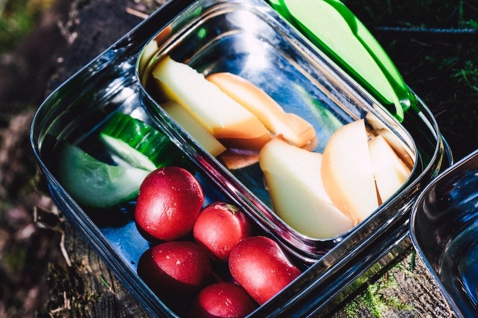

import React from 'react';
import { Link } from 'gatsby';

import Paths from '../constants/Paths.js';

# Zero Waste Products

## What Is Zero Waste?

Before you begin your journey to switching over to zero-waste products, it is important to first understand what zero waste is. In simple words, zero-waste is a waste prevention concept which tries to accomplish the goal of sending the least amount of waste as possible to landfills and also by going greener in general. This includes waste produced in the production of a product and the waste produced by consumers when they are done with the product.

Some ways you can help contribute towards this goal include using reusable substitutes; placing recyclables into the correct bins even if they are separated by glass, plastic, and aluminum; and reducing the use of single-use products (as in plastic straws and plastic cutlery). For example, if you are tired of spending $5 on coffee every day and filling up your trash bin with the same plastic coffee cups every day, you can purchase a reusable travel coffee cup (which can be considered a zero waste product) and make coffee at home. Another option that is only available in select Starbucks locations is that consumers have the option to buy a reusable coffee cup (which is also considered a zero-waste product) in exchange for a $0.10 discount. There are plenty of ways you can implement a zero-waste lifestyle by bringing zero waste products into your life.

We at Alliance Disposal encourage not just our customers but everyone in general to consider using zero waste products because our goals align with those of the zero-waste movement; to maintain our environment and keep it healthy for as long as possible. To learn more about our efforts towards sustainability and zero-waste, check out our <Link to={Paths.about}>Plant A Tree</Link> mission statement and see what else we’ve been doing to achieve sustainability. 

Zero-waste products can be found in almost every trade even though they are still new and somewhat rare. If you are interested in living a zero-waste lifestyle but you don’t know where to start, here is a guide consisting of zero-waste alternatives to your current products to help you get started. 

## Zero Waste Cleaning Products

- Reusable natural fabric softener balls in place of liquid fabric softener or fabric softener sheets: Most liquid fabric softeners come in plastic bottles or containers, and a lot of times they can’t be reused for anything else. And most fabric softener sheets aren’t reusable, so using them every time you do your laundry contributes to the landfill we are trying to eliminate or at least reduce. Switching over to <a href='https://www.tumblewool.com/blogs/blog/the-benefits-of-wool-dryer-balls#:~:text=When%20you%20use%20non%2Dtoxic,be%20fresh%20and%20wrinkle%2Dfree.' target="_blank" rel="noopener norefferer">fabric softener balls</a> eliminates the use of plastic and trash because they can be used over and over again. For fresher smelling laundry, it is also suggested to spritz a couple drops of essential oils on the fabric softener balls.

- Reusable cotton cloths or towels instead of paper towels: Rather than taking off a piece of paper towel each time you want to dry your hands, you can use a reusable cotton cloth or towel instead because you won’t be adding more to the trash. They can also be useful if you want to dry your dishes after washing them.

- Bulk castile soap instead of the conventional dish soap: A well-known company called <a href='https://www.drbronner.com/about/' target="_blank" rel="noopener norefferer">Dr. Bronner’s</a> sells castile soap that has many uses from shampooing to dish washing. One unique quality about Dr. Bronner’s castile soap is that it is often sold in bulk, so consumers are able to reduce their amount of household waste. Not only that, but their packaging is made from 100% recycled bottles and the soap itself is biodegradable. Though it is important to note that castile soap does have a certain reaction when exposed to minerals in hard water, which makes washing dishes specifically slightly difficult in that there is a thin layer of film left behind.

- Homemade multipurpose cleaner instead of a collection of different cleaners with chemicals: By creating your own concoction at home for cleaning purposes, you are cleaning your home without chemicals. Also, by using only one cleaner, you will be saving the environment by reducing the number of plastic containers you would be using if you cleaned with multiple store-bought cleaners.

- Laundry and dish detergent pods and pastes: Laundry detergent pods are better than their liquid counterparts because they don’t use any plastic at all, which means less contribution to the landfill.   

## Zero Waste Food/Kitchen Products

- Coffee maker and an optional reusable coffee filter instead of going to a coffee shop every morning: This method is both a money saver and good for the environment. By investing in your own coffee maker, you will be saving yourself a lot of time and money because you won’t have to rush to a coffee shop every morning to buy coffee before work. Some coffee makers do require you to use coffee filters, so getting yourself a filter made of reusable material will be better in the long run because you won’t be throwing them out after every use.

- Reusable shopping and grocery bags instead of plastic bags: By bringing your own shopping bag to pack your groceries in, you will be contributing to a cleaner environment because plastic bags are harmful for the environment. Plus, less trash sent to the landfills. Fun fact: some cities including Seattle, Washington have you pay an extra few cents to use their plastic bags to encourage customers to start using reusable bags.

- Stainless steel or any reusable straws instead of plastic straws: Many of us use straws on a regular basis especially when we purchase cold drinks from restaurants and cafes. Since they are so commonly used all over the world, they are also one of the more common forms of waste thrown in the growing landfills. That’s why it is better for the environment to start using reusable straws made from clean materials. To help this cause, select Starbucks locations have started serving drinks in cups with lids that have a mouth to drink from, eliminating the need for any straws.

- Reusable containers or reusable cottons sandwich bags instead of plastic sandwich bags: Plastic sandwich bags like Zip-Loc can easily be trashed once their use is over, and they aren’t good for the environment either. That’s why it is better to use reusable silicone or glass containers to store food in. Not only does food last longer in said containers compared to plastic sandwich bags, but they can easily be cleaned and reused too. A washable cotton sandwich bag is also another option, especially for ease when carrying food to work.

- Wooden dish brush instead of a sponge: Sponges do a good job of cleaning dishes, but they can easily be torn by knives or other sharp utensils. A wooden dish brush is made from rough bristles to prevent breakage, but also to provide a deeper clean.

## Zero Waste Personal Care Products

- Bamboo toothbrush instead of a plastic toothbrush: Bamboo itself is a natural material unlike plastic. Bamboo toothbrushes are better for the environment because they have considerably less ecological footprint compared to plastic toothbrushes. Even after a <a href='https://www.colgate.com/en-us/oral-health/basics/selecting-dental-products/is-a-bamboo-toothbrush-right-for-you--' target="_blank" rel="noopener norefferer">bamboo toothbrush</a> has come to the end of its use, the handle of the bamboo toothbrush can be reused.

- Natural toothpaste tablets instead of toothpaste in a tube: Toothpaste tubes are normally made out of materials harmful for the environment, like plastic. Each time the tube is finished, you throw it out; therefore, contributing to the landfill we are trying to reduce if not eliminate. Replacing toothpaste tubes with toothpaste tablets is efficient because the tablets come in one jar, and all you have to do is take one by mouth. And many times, the jar can be reused for something else, like holding your toothbrushes for example.

- Shampoo bars instead of bottled shampoos: Shampoo bars are not very common right now and it may be a strange concept to some people, but they are actually better for not only your hair, but also the environment. <a href='https://stylecaster.com/beauty/should-you-be-using-bar-shampoo/#slide-1' target="_blank" rel="noopener norefferer">Shampoo bars</a> aren’t made from harmful, drying ingredients that your regular shampoos are made from. In that sense, bar shampoos are better for your hair because they don’t contain the sulfates and various other harmful ingredients that strip your hair of its natural oils and may cause other forms of damage to your hair. However, bar shampoos are also a good zero waste product because of the way its produced. They don’t come in packaging that harms the environment like bottled liquid shampoos do. Instead, they come in small boxes or cardboard containers that can be recycled easily. 

- Dental lace instead of dental floss: At first glance, <a href='https://www.dentallace.com/pages/about-us' target="_blank" rel="noopener norefferer" target="_blank" rel="noopener norefferer">dental lace </a> and dental floss might look the same, but they are quite different. Made from 100% Mulberry silk, dental lace is a zero-waste product that performs the same way as regular dental floss, except more sustainably. Regular dental floss is made from plastic, and it usually comes in a plastic container, neither of which are beneficial for the environment.

- Natural wood hairbrush instead of a hairbrush with plastic bristles: Natural wood hairbrushes are better for your hair’s overall health and strength because they don’t roughly pull on your hair the way plastic bristled hairbrushes do. Though natural wood hair brushes are also better than plastic bristled hair brushes because of their benefits for the environment. 

